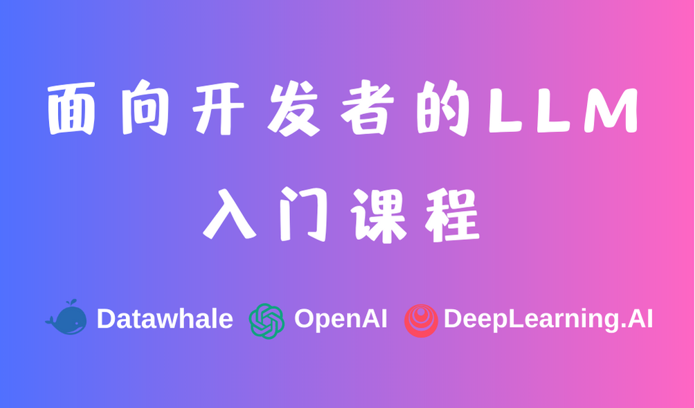
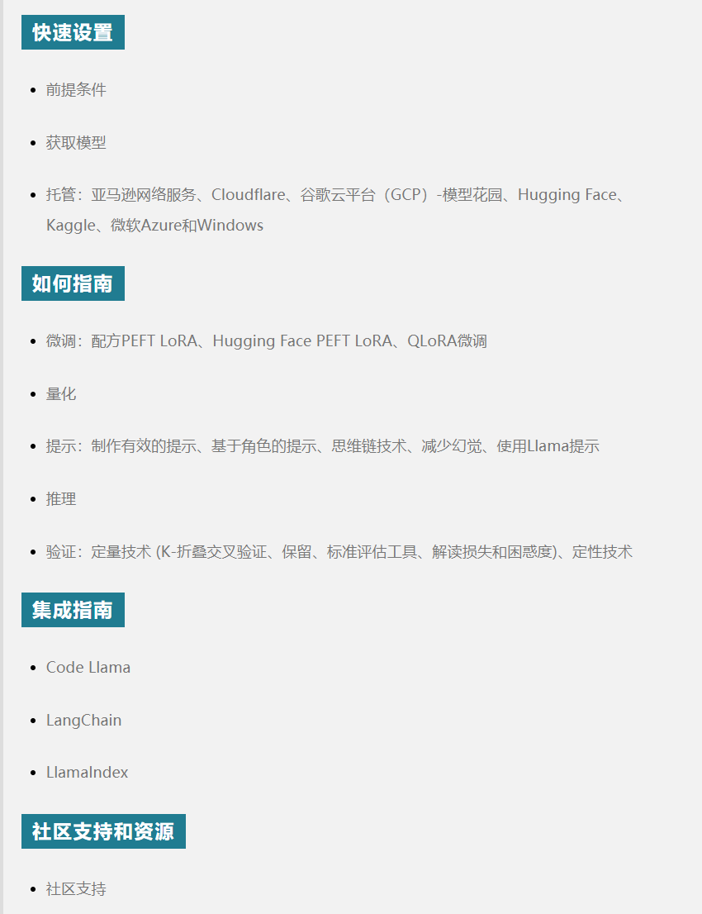
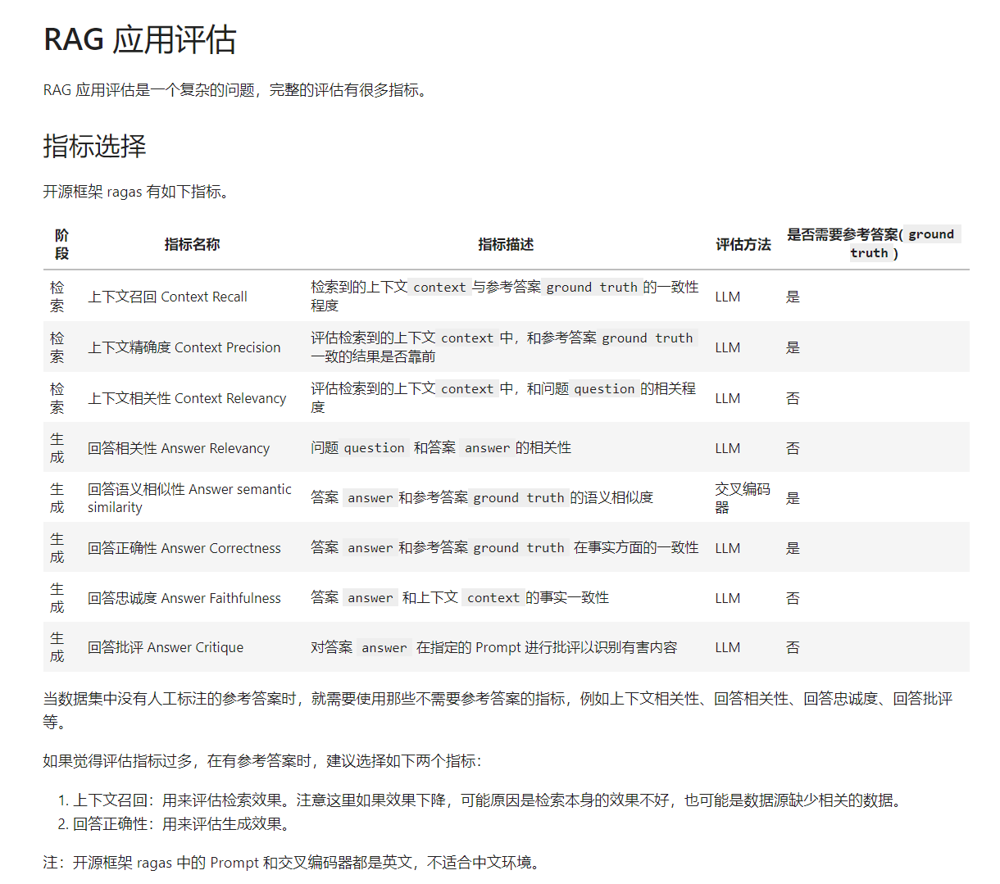
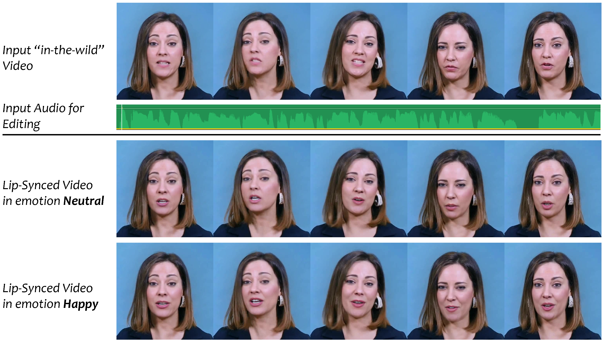
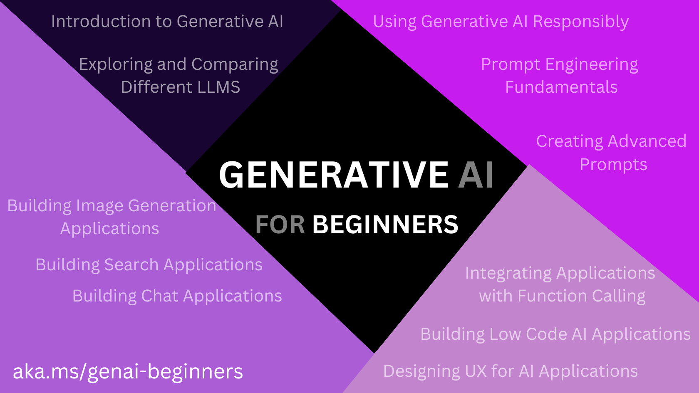

# awesomeProject第2期

## LLM

### Prompt Engineering Guide

- 链接：https://www.promptingguide.ai/zh

- 介绍：提示工程指南（Prompt Engineering Guide）是由 DAIR.AI 发起的项目，分别从哪个提示工程简介、提示技术、提示应用、模型、风险和误用、论文、工具和库等方面来帮助用户更好地了解大型语言模型的能力和局限性。

- 推荐指数：⭐️⭐️⭐️⭐️⭐️

### prompt-engineering-for-developers

- 链接：https://datawhalechina.github.io/prompt-engineering-for-developers/

- 介绍：本项目是一个面向开发者的 LLM 入门教程，由Datawhale组织基于吴恩达老师大模型系列课程内容，将原课程内容翻译为中文并复现其范例代码，实现中文 Prompt，指导国内开发者如何基于 LLM 快速、高效开发具备强大能力的应用程序。

- 推荐指数：⭐️⭐️⭐️⭐️⭐️

###  Llama2 入门指南

- 链接：https://ai.meta.com/llama/get-started

- 介绍：官方的Llama 2教程，首先介绍了Llama 2的快速设置和操作指南，包括先决条件、获取模型和托管。然后，详细介绍了如何微调、量化、提示和推理Llama 2。接着提供了集成指南，包括Code Llama、LangChain和LlamaIndex。最后，文章讨论了社区支持和资源，以及如何提交反馈和建议。

- 推荐指数：⭐️⭐️⭐️⭐️⭐️

### GATE

- 链接：https://github.com/alextamkin/generative-elicitation 

- 介绍：麻省理工学院研究人员开发出一种GATE框架,解决用户不会LLMs提示词的问题,GATE会主动地与你进行开放式的对话，通过一些列对话了解你的需求和偏好。了解用户的需求后，GATE就会生成适当的Prompt，然后传给LLMs。这样模型就能更准确地生成符合你需求的答案。

- 推荐指数：⭐️⭐️⭐️⭐️

### langeval

- 链接：https://github.com/ninehills/langeval

- 介绍：开源 langeval 框架，核心功能是给大模型Prompt以及App做评估。

- 推荐指数：⭐️⭐️⭐️⭐️

### LLM-Agent-Paper-List

- 链接：https://github.com/WooooDyy/LLM-Agent-Paper-List

- 介绍：The Rise and Potential of Large Language Model Based Agents: A Survey 的paper 列表，对基于 LLM 的Agent进行了系统且全面的调查，并列出了一些必读论文。

- 推荐指数：⭐️⭐️⭐️⭐️⭐️

## 音频

### VideoReTalking 让视频中的人物随意【对嘴型】

- 链接：https://github.com/OpenTalker/video-retalking

- 介绍：提出了一种名为VideoReTalking的音频驱动的唇同步技术，用于在现实世界中编辑说话者视频。VideoReTalking通过使用音频信号来驱动视频中的唇部运动，从而实现高质量的唇同步。这种方法可以应用于各种场景，如电影、广告、新闻等，以提高视频的观看体验。VideoReTalking算法的主要实现步骤：

  - 音频处理：首先，从输入的音频信号中提取特征，如梅尔频率倒谱系数（MFCC）等。这些特征将用于驱动视频中的唇部运动。

  - 唇部运动预测：使用一个深度学习模型（如卷积神经网络，CNN）来预测视频中每个帧的唇部运动。这个模型通过训练数据集学习音频特征与唇部运动之间的关系。

  - 唇部运动生成：根据预测的唇部运动，生成一个新的视频序列。这可以通过插值、变形等技术实现。新生成的视频序列将具有与输入音频信号同步的唇部运动。

  - 视频合成：将生成的唇部运动序列与原始视频中的其他部分（如面部表情、头部运动等）合成，得到最终的编辑后的视频。

- 推荐指数：⭐️⭐️⭐️⭐️⭐️

## 生成式AI

- 链接：https://github.com/microsoft/generative-ai-for-beginners 

- 介绍：微软推出的专门针对初学者的生成式人工智能课程，通过 Microsoft Cloud Advocates 提供的 12 课时综合课程，了解构建生成式 AI 应用程序的基础知识。12 课时的课程，旨在教授初学者如何开始构建生成式AI应用。每节课都涵盖了生成式AI原理和应用开发的关键方面。在这个课程的学习过程中，学员不仅仅是学习理论知识，而是会实际操作，模拟创建一个使用生成式AI技术的创业公司。

- 推荐指数：⭐️⭐️⭐️⭐️⭐️

