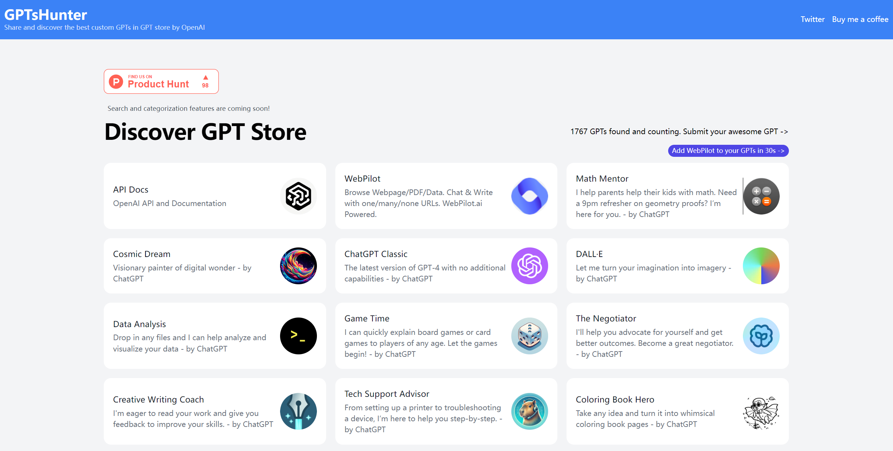

# awesomeProject第3期

## 深度学习

### Animatedai

- 链接：https://animatedai.github.io/

- 介绍：用动画代替方程，揭开人工智能和神经网络的神秘面纱。该网站使用以易于理解的动画方式解释了书面难以理解的广泛用于机器学习领域的“卷积神经网络（CNN）”

- 推荐指数：⭐️⭐️⭐️⭐️⭐️

### python机器学习资源与工具库大全

- 链接：https://github.com/HanXinzi-AI/awesome-python-machine-learning-resources

- 介绍：本资源清单包含python机器学习相关的开源工具资源，这些热门工具总共分成32个不同的子板块
  - [机器学习框架](#机器学习框架) _54 个项目_
  - [数据可视化](#数据可视化) _49 个项目_
  - [文本数据和NLP](#文本数据和NLP) _82 个项目_
  - [图像数据与CV](#图像数据与CV) _49 个项目_
  - [图数据处理](#图数据处理) _29 个项目_
  - [音频处理](#音频处理) _23 个项目_
  - [地理Geo处理](#地理Geo处理) _22 个项目_
  - [金融数据处理](#金融数据处理) _23 个项目_
  - [时间序列](#时间序列) _20 个项目_
  - [医疗领域](#医疗领域) _19 个项目_
  - [光学字符识别OCR](#光学字符识别OCR) _11 个项目_
  - [数据容器和结构](#数据容器和结构) _28 个项目_
  - [数据读写与提取](#数据读写与提取) _23 个项目_
  - [网页抓取和爬虫](#网页抓取和爬虫) _1 个项目_
  - [数据管道和流处理](#数据管道和流处理) _36 个项目_
  - [分布式机器学习](#分布式机器学习) _26 个项目_
  - [超参数优化和AutoML](#超参数优化和AutoML) _45 个项目_
  - [强化学习](#强化学习) _19 个项目_
  - [推荐系统](#推荐系统) _13 个项目_
  - [隐私机器学习](#隐私机器学习) _6 个项目_
  - [工作流程和实验跟踪](#工作流程和实验跟踪) _35 个项目_
  - [模型序列化和转换](#模型序列化和转换) _11 个项目_
  - [模型的可解释性](#模型的可解释性) _46 个项目_
  - [向量相似度搜索（ANN）](#向量相似度搜索（ANN）) _12 个项目_
  - [概率统计](#概率统计) _21 个项目_
  - [对抗学习与鲁棒性](#对抗学习与鲁棒性) _7 个项目_
  - [GPU实用程序](#GPU实用程序) _18 个项目_
  - [Tensorflow实用程序](#Tensorflow实用程序) _13 个项目_
  - [Sklearn实用程序](#Sklearn实用程序) _17 个项目_
  - [Pytorch实用程序](#Pytorch实用程序) _27 个项目_
  - [数据库客户端](#数据库客户端) _1 个项目_
  - [中文自然语言处理](#中文自然语言处理) _2 个项目_
  - [Others](#Others) _33 个项目_

- 推荐指数：⭐️⭐️⭐️⭐️⭐️

### Jupyter资源与工具库大全

- 链接：https://github.com/HanXinzi-AI/awesome-jupyter-resources

- 介绍：本资源清单包含jupyter相关的开源工具资源，这些热门工具总共分成13个不同的子板块
  - [Notebook环境](#Notebook环境) _13 个项目_
  - [交互式小部件和可视化](#交互式小部件和可视化) _49 个项目_
  - [Jupyter拓展](#Jupyter拓展) _23 个项目_
  - [Jupyter-magic拓展](#Jupyter-magic拓展) _10 个项目_
  - [Jupyter内核](#Jupyter内核) _36 个项目_
  - [Jupyter-Notebook分享与格式转换](#Jupyter-Notebook分享与格式转换) _23 个项目_
  - [Jupyter-Notebook工具](#Jupyter-Notebook工具) _24 个项目_
  - [JupyterLab渲染器](#JupyterLab渲染器) _7 个项目_
  - [JupyterLab主题](#JupyterLab主题) _8 个项目_
  - [JupyterLab扩展](#JupyterLab扩展) _50 个项目_
  - [JupyterHub认证](#JupyterHub认证) _15 个项目_
  - [JupyterHub容器等](#JupyterHub容器等) _8 个项目_
  - [Jupyter组件](#Jupyter组件) _3 个项目_
  - [Others](#Others) _4 个项目_

- 推荐指数：⭐️⭐️⭐️⭐️⭐️

### 自然语言处理项目&工具库&资源大全

- 链接：https://github.com/HanXinzi-AI/awesome-NLP-resources

- 介绍：本资源清单包含100个python自然语言处理相关的项目&工具库&资源，这些资源总共分成11个不同的子板块
  - [文本分类](#文本分类) _9 个项目案例_
  - [情感分析](#情感分析) _6 个项目案例_
  - [序列标注](#序列标注) _5 个项目案例_
  - [问答系统与聊天机器人](#问答系统与聊天机器人) _8 个项目案例_
  - [语音应用](#语音应用) _11 个项目案例_
  - [知识图谱](#知识图谱) _10 个项目案例_
  - [文本生成](#文本生成) _11 个项目案例_
  - [文本摘要生成](#文本摘要生成) _10 个项目案例_
  - [阅读理解](#阅读理解) _4 个项目案例_
  - [时间序列](#时间序列) _10 个项目案例_
  - [机器翻译](#机器翻译) _8 个项目案例_
  - [文本检索与语义匹配](#文本检索与语义匹配) _9 个项目案例_

- 推荐指数：⭐️⭐️⭐️⭐️⭐️

### 计算机视觉项目&工具库&资源大全

- 链接：https://github.com/HanXinzi-AI/awesome-computer-vision-resources
  
- 介绍：本资源清单包含120个计算机视觉相关的项目&工具库&资源，这些资源总共分成12个不同的子板块
  - [图像分类](#图像分类) _10 个项目案例_
  - [目标检测](#目标检测) _13 个项目案例_
  - [图像分割](#图像分割) _8 个项目案例_
  - [OCR文字识别](#OCR文字识别) _11 个项目案例_
  - [图文转换ImageCaptioning与视觉问答VQA](#图文转换ImageCaptioning与视觉问答VQA) _11 个项目案例_
  - [图图转换ImageTranslation](#图图转换ImageTranslation) _9 个项目案例_
  - [图像超分辨率](#图像超分辨率) _10 个项目案例_
  - [人脸检测与识别](#人脸检测与识别) _10 个项目案例_
  - [医疗影像](#医疗影像) _7 个项目案例_
  - [行人检测](#行人检测) _5 个项目案例_
  - [自动驾驶](#自动驾驶) _6 个项目案例_
  - [生成对抗网络GAN](#生成对抗网络GAN) _10 个项目案例_
  - [模型压缩与优化](#模型压缩与优化) _9 个项目案例_

- 推荐指数：⭐️⭐️⭐️⭐️⭐️

## LLM

### Awesome AI Agents

- 链接：https://github.com/e2b-dev/awesome-ai-agents

- 介绍：收录一些AI Agent相关的项目

- 推荐指数：⭐️⭐️⭐️⭐️⭐️

### LLaMA Rider

- 链接：https://github.com/PKU-RL/LLaMA-Rider

- 介绍：北京大学和北京智源人工智能研究院的团队提出的 LLaMA-Rider，赋予了大模型在开放世界中探索任务、收集数据、学习策略的能力，助力Agent在《我的世界》中自主探索获取知识并学习解决各种任务，提升Agent自主能力和通用性。

- 推荐指数：⭐️⭐️⭐️⭐️⭐️

### GPTsHunter

- 链接：https://www.gptshunter.com/

- 介绍：该项目分享并发现 OpenAI GPT 商店中最好的自定义 GPT,截止目前，已收录了1767 GPTs。

- 推荐指数：⭐️⭐️⭐️⭐️⭐️

### 完蛋！我被 LLM 包围了！

- 链接：https://modelscope.cn/studios/LLMRiddles/LLMRiddles/summary

- 介绍：通过解谜游戏的方式轻松学会大模型提示词技巧，游戏共四章、19道题，玩家通过设计提示词，想方设法让模型输出指定答案。

- 推荐指数：⭐️⭐️⭐️⭐️⭐️

## Tools

- 链接：https://huggingface.co/spaces/ysharma/OpenAI_TTS_New

- 介绍：基于 OpenAI 的 TTS 模型将文本转换为逼真的语音音频，并提供了一个名为speech的 API。支持多种语言，比如英语、西班牙语、法语、德语、意大利语等，此外，还支持 tts-1、tts-1-hd 和 tts-2等多种语音模型，并且可以在5 种男声和2种女声中进行切换。

- 推荐指数：⭐️⭐️⭐️⭐️⭐️

## 其他

### Awesome-Python-Resources

- 链接：https://github.com/HanXinzi-AI/awesome-python-resources

- 介绍：本资源清单包含690个python相关的开源工具资源，这些热门工具总共分成91个不同的应用领域，
  - [Admin Panels](#admin-panels) _9 projects_
  - [Algorithms and Design Patterns](#algorithms-and-design-patterns) _7 projects_
  - [ASGI Servers](#asgi-servers) _2 projects_
  - [Asynchronous Programming](#asynchronous-programming) _4 projects_
  - [Audio](#audio) _13 projects_
  - [Authentication](#authentication) _9 projects_
  - [Build Tools](#build-tools) _5 projects_
  - [Built-in Classes Enhancement](#built-in-classes-enhancement) _5 projects_
  - [CMS](#cms) _8 projects_
  - [Caching](#caching) _7 projects_
  - [ChatOps Tools](#chatops-tools) _1 projects_
  - [Code Analysis](#code-analysis) _20 projects_
  - [Command-line Interface Development](#command-line-interface-development) _12 projects_
  - [Command-line Tools](#command-line-tools) _16 projects_
  - [Compatibility](#compatibility) _3 projects_
  - [Computer Vision](#computer-vision) _7 projects_
  - [Concurrency and Parallelism](#concurrency-and-parallelism) _5 projects_
  - [Configuration](#configuration) _5 projects_
  - [Cryptography](#cryptography) _4 projects_
  - [Data Analysis](#data-analysis) _6 projects_
  - [Data Validation](#data-validation) _7 projects_
  - [Data Visualization](#data-visualization) _14 projects_
  - [Database](#database) _3 projects_
  - [Database Drivers](#database-drivers) _17 projects_
  - [Date and Time](#date-and-time) _10 projects_
  - [Debugging Tools](#debugging-tools) _18 projects_
  - [Deep Learning](#deep-learning) _7 projects_
  - [DevOps Tools](#devops-tools) _13 projects_
  - [Distributed Computing](#distributed-computing) _7 projects_
  - [Distribution](#distribution) _8 projects_
  - [Documentation](#documentation) _4 projects_
  - [Downloader](#downloader) _5 projects_
  - [E-commerce](#e-commerce) _10 projects_
  - [Editor Plugins and IDEs](#editor-plugins-and-ides) _10 projects_
  - [Email](#email) _6 projects_
  - [Enterprise Application Integrations](#enterprise-application-integrations) _1 projects_
  - [Environment Management](#environment-management) _2 projects_
  - [Files](#files) _7 projects_
  - [Foreign Function Interface](#foreign-function-interface) _4 projects_
  - [Forms](#forms) _6 projects_
  - [Functional Programming](#functional-programming) _7 projects_
  - [GUI Development](#gui-development) _16 projects_
  - [GraphQL](#graphql) _4 projects_
  - [Game Development](#game-development) _9 projects_
  - [Geolocation](#geolocation) _5 projects_
  - [HTML Manipulation](#html-manipulation) _11 projects_
  - [HTTP Clients](#http-clients) _6 projects_
  - [Hardware](#hardware) _7 projects_
  - [Image Processing](#image-processing) _14 projects_
  - [Implementations](#implementations) _13 projects_
  - [Interactive Interpreter](#interactive-interpreter) _4 projects_
  - [Internationalization](#internationalization) _2 projects_
  - [Job Scheduler](#job-scheduler) _11 projects_
  - [Logging](#logging) _5 projects_
  - [Machine Learning](#machine-learning) _9 projects_
  - [Microsoft Windows](#microsoft-windows) _5 projects_
  - [Miscellaneous](#miscellaneous) _6 projects_
  - [Natural Language Processing](#natural-language-processing) _13 projects_
  - [Network Virtualization](#network-virtualization) _3 projects_
  - [News Feed](#news-feed) _2 projects_
  - [ORM](#orm) _13 projects_
  - [Package Management](#package-management) _5 projects_
  - [Package Repositories](#package-repositories) _4 projects_
  - [Penetration Testing](#penetration-testing) _3 projects_
  - [Permissions](#permissions) _2 projects_
  - [Processes](#processes) _3 projects_
  - [Recommender Systems](#recommender-systems) _8 projects_
  - [Refactoring](#refactoring) _3 projects_
  - [RESTful API](#restful-api) _13 projects_
  - [Robotics](#robotics) _2 projects_
  - [RPC Servers](#rpc-servers) _1 projects_
  - [Science](#science) _21 projects_
  - [Search](#search) _5 projects_
  - [Serialization](#serialization) _4 projects_
  - [Serverless Frameworks](#serverless-frameworks) _2 projects_
  - [Shell](#shell) _1 projects_
  - [Specific Formats Processing](#specific-formats-processing) _17 projects_
  - [Static Site Generator](#static-site-generator) _5 projects_
  - [Tagging](#tagging) _1 projects_
  - [Task Queues](#task-queues) _5 projects_
  - [Template Engine](#template-engine) _3 projects_
  - [Testing](#testing) _30 projects_
  - [Text Processing](#text-processing) _22 projects_
  - [Third-party APIs](#third-party-apis) _7 projects_
  - [URL Manipulation](#url-manipulation) _4 projects_
  - [Video](#video) _3 projects_
  - [Web Asset Management](#web-asset-management) _7 projects_
  - [Web Content Extracting](#web-content-extracting) _9 projects_
  - [Web Crawling](#web-crawling) _8 projects_
  - [Web Frameworks](#web-frameworks) _8 projects_
  - [WebSocket](#websocket) _3 projects_
  - [WSGI Servers](#wsgi-servers) _5 projects_
  
- 推荐指数：⭐️⭐️⭐️⭐️⭐️