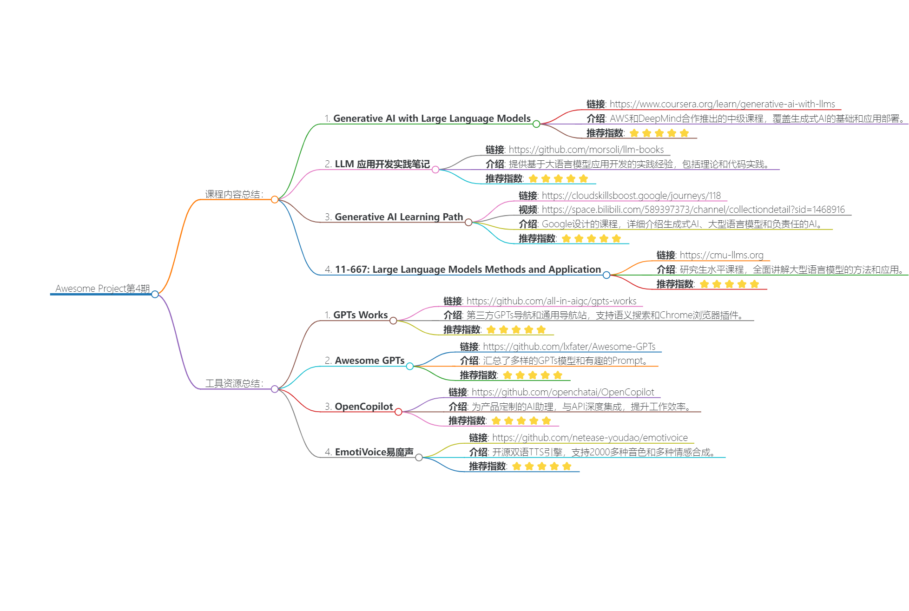

# Awesome Project第4期

## Course

### Generative AI with Large Language Models

- 链接：https://www.coursera.org/learn/generative-ai-with-llms

- 介绍： 由AWS 和 DeepMind 合作推出的大模型学习课程，本课程学习生成式 AI 工作原理以及如何将其部署到实际应用程序中的基础知识。课程难度为中级，适合具有一定 Python 编程经验的学员。主要包含生成式人工智能应用案例、项目生命周期和模型预训练、微调和评估大语言模型、强化学习和大语言模型驱动的应用等内容。

- 推荐指数：⭐️⭐️⭐️⭐️⭐️

### LLM 应用开发实践笔记
- 链接：https://github.com/morsoli/llm-books

- 介绍： 在学习开发基于大语言模型的应用过程中，总结出来的一些经验和方法以及接触到的一些资源，采用理论学习和代码实践相结合的形式。包含理论学习和代码实践两部分。其中，理论学习部分由Langchain、LlamaIndex等开源工具文档、一些最佳实践的技术博客、论文阅读三部分组成。代码实践部分，在每个工具的理论学习结束后，辅以实践性代码帮助理解。最后会将各个模块整合起来实现一个信息处理系统。
  
- 推荐指数：⭐️⭐️⭐️⭐️⭐️

### Generative AI Learning Path

- 链接：https://cloudskillsboost.google/journeys/118

- 视频：https://space.bilibili.com/589397373/channel/collectiondetail?sid=1468916
  
- 介绍： Google推出的课程，本学习路径概述了生成式人工智能的概念，从大型语言模型的基本原理到负责任的人工智能原则。课程内容包括：解释什么是生成式 AI、它的用途以及与传统机器学习方法的区别；探讨什么是大型语言模型 (LLM)、适合的应用场景以及如何使用提示调整来提升 LLM 性能；解释什么是负责任的人工智能，为什么它很重要，以及Google如何在其产品中实施负责任的人工智能等

- 推荐指数：⭐️⭐️⭐️⭐️⭐️

### 11-667: Large Language Models Methods and Application

- 链接：https://cmu-llms.org

  
- 介绍： 大型语言模型方法和应用（11-667）是一门研究生课程，旨在提供大型语言模型当前状态的整体视图。本课程的前半部分从语言模型的基础开始，包括网络架构、训练、推理和评估。然后讨论大型语言模型的解释（或尝试）、对齐和新兴功能，然后讨论其在语言任务中的流行应用以及文本之外的新用途。在后半部分，本课程首先介绍扩大语言模型预训练的技术以及使大型模型的预训练及其部署更加高效的最新方法。然后讨论了围绕大型语言模型部署的各种问题，并总结了LLM发展的挑战和前沿。

- 推荐指数：⭐️⭐️⭐️⭐️⭐️

## Tools

### GPTs Works

- 链接：https://github.com/all-in-aigc/gpts-works
  
- 介绍： 这是一个第三方的GPTs 商店，不仅仅可以用于做 GPTs 导航，还可以用来做通用导航站。此外，还集成了向量化处理，即用户可以用自然语言语义化来搜索，而不仅仅靠关键词匹配。最后支持以Chrome浏览器插件方式安装。

- 推荐指数：⭐️⭐️⭐️⭐️⭐️

### Awesome GPTs 

- 链接：https://github.com/lxfater/Awesome-GPTs
  
- 介绍： 列举了一些GPTs和一些有意思的Prompt。

- 推荐指数：⭐️⭐️⭐️⭐️⭐️

### OpenCopilot

- 链接：https://github.com/openchatai/OpenCopilot
  
- 介绍： OpenCopilot旨在成为用户自己的AI副驾驶，专门为他们的产品量身定制。与通用的AI解决方案不同，OpenCopilot与产品的底层API深度集成。凭借轻松执行 API 调用的主要功能，它是一种工具，可以显着提高效率并减少与 API 接口所涉及的手动工作。它的操作植根于使用大型语言模型 （LLM），该模型分析用户请求以确定 API 调用的必要性。在做出这样的决定后，OpenCopilot 会选择合适的 API 端点，并根据 API 定义发送所需的有效负载。

- 推荐指数：⭐️⭐️⭐️⭐️⭐️

### EmotiVoice易魔声 😊: 多音色提示控制TTS

- 链接：https://github.com/netease-youdao/emotivoice
  
- 介绍： EmotiVoice是一个强大的开源TTS引擎，支持中英文双语，包含2000多种不同的音色，以及特色的情感合成功能，支持合成包含快乐、兴奋、悲伤、愤怒等广泛情感的语音。EmotiVoice提供一个易于使用的web界面，还有用于批量生成结果的脚本接口。

- 推荐指数：⭐️⭐️⭐️⭐️⭐️

