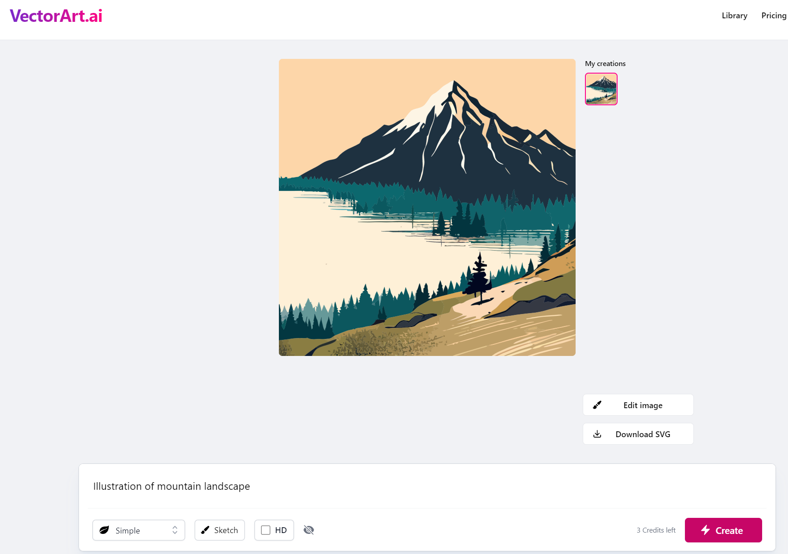

# Awesome Project第5期

## Course

### 如何阅读一篇论文

- 链接：https://web.stanford.edu/class/ee384m/Handouts/HowtoReadPaper.pdf

- 介绍：这篇文章主要介绍了一种名为“三遍阅读法”的高效阅读研究论文的方法。作者S. Keshav是加拿大滑铁卢大学计算机科学教授，他分享了自己的经验，帮助研究者更高效地阅读和理解论文。
- 
三遍阅读法包括以下三个阶段：

- 第一遍：快速浏览。在这个阶段，读者应该仔细阅读标题、摘要和引言，查看图表，阅读章节和小节标题，并阅读结论。这个阶段的目的是获取论文的大致概念，决定是否需要进一步阅读。

- 第二遍：深入阅读。在这个阶段，读者需要更仔细地阅读论文，但可以忽略细节，如证明过程。在这个阶段，读者应该记下关键点或在边缘做注释。这个阶段的目标是理解论文的内容，但不需要理解所有细节。

- 第三遍：全面理解。这个阶段的目标是深入理解论文，尤其是当你需要对其进行评审时。读者应尝试重新实现论文的内容，比较自己的理解和实际论文的内容，从而发现可能的问题和假设。

此外，文章还介绍了如何使用这种方法进行文献调查。首先，通过学术搜索引擎找到几篇近期的相关论文；然后，通过阅读这些论文的参考文献和相关研究，找到关键的论文和作者；最后，阅读这些关键论文，进行深入的理解和分析。

- 推荐指数：⭐️⭐️⭐️⭐️⭐️

## Tools

### Aminer

- 链接：www.aminer.cn
  
- 介绍：由清华大学计算机系研发的学术信息挖掘平台，可以很大程度帮助降低检索和学习论文的门槛。如果你有一个明确的研究方向，可以在它的「必读论文」模块中找到对应的优质论文集，这些内容都是由 AI 初筛 + 学者复核后呈现出来的，可以为自己省去海量的信息挖掘时间。

- 推荐指数：⭐️⭐️⭐️⭐️⭐️

### GPTseek

- 链接：https://gptseek.com
  
- 介绍：发现优质的 GPTs。可以根据评分来排序，导航和分类都很清晰，可以查找相似 GPTs。

- 推荐指数：⭐️⭐️⭐️⭐️⭐️

###  Vectorart

- 链接：https://vectorart.ai/
  
- 介绍：根据文本生成SVG矢量图片，个人或者教育用途可以免费下载，商业用途需要付费。

- 推荐指数：⭐️⭐️⭐️⭐️⭐️

###  Draw Fast

- 链接：https://github.com/tldraw/draw-fast

- 试用链接：https://www.fal.ai/models/latent-consistency-sd?continueFlag=f23e7848cecda496b7bcfdb715083ed9

- 介绍：使用Latent Consistency Models将实时将草图渲染成真实的图片，

- 推荐指数：⭐️⭐️⭐️⭐️⭐️

###  UI Sketcher

- 链接：https://github.com/pAIrprogio/vscode-ui-sketcher

- 介绍：是一个VSCode插件，依据GPT-4V的多模态能力，可以通过画出界面草图，就能生成一个基于ReactNative的UI界面。

- 推荐指数：⭐️⭐️⭐️⭐️⭐️

###  bloop

- 链接：https://github.com/BloopAI/bloop

- 介绍：一个用 Rust 和 Typescript 编写的快速代码搜索引擎。同时它接入了GPT-4，使得可以直接使用自然语言来搜索，以及用自然语言来解释代码库是做什么的。同时支持正则表达式和过滤查询搜索本地和远程存储库。
  
- 推荐指数：⭐️⭐️⭐️⭐️⭐️

