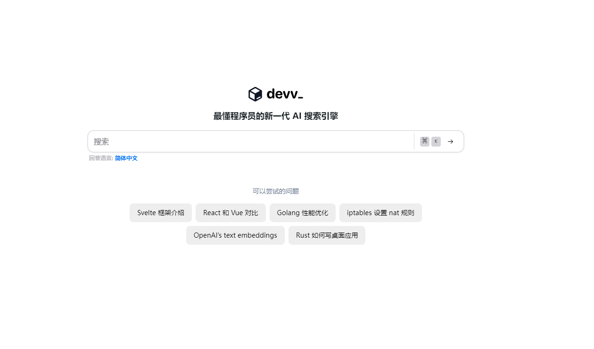

# Awesome Project第6期

## Tools

### 最懂程序员的新一代 AI 搜索引擎

- 链接：https://devv.ai/

- 介绍：Devv.ai 是一个专门为开发者设计的 AI 搜索引擎。它的目标是为编程领域提供比传统搜索引擎如 Google 或开发者社区如 StackOverflow 更精确和高效的答案。Devv.ai 的开发团队构建了一个高效且准确的系统，该系统基于文档、代码和实时搜索数据，并且使用了微调后的 Code Llama 和 GPT-3.5 模型。用户反馈显示，Devv.ai 的搜索结果比 GPT-4 更清晰，信息源质量也非常高，能够在很大程度上满足开发者在编程过程中的查询需求。

- 推荐指数：⭐️⭐️⭐️⭐️⭐️

### 公益学术平台PubScholar

- 链接：https://pubscholar.cn/

- 介绍：PubScholar公益学术平台是中国科学院作为国家战略科技力量的主力军，履行学术资源保障“国家队”职责，为满足全国科技界和全社会科技创新的学术资源基础保障需求，建设的提供公益性学术资源的检索发现、内容获取和交流共享等服务的平台。

- 推荐指数：⭐️⭐️⭐️⭐️⭐️

### 始智AI

- 链接：https://www.wisemodel.cn
  
- 介绍：始智AI，国内版的huggingface。目前的功能主要是提供开源模型和数据集下载、讨论。 ​​​

- 推荐指数：⭐️⭐️⭐️⭐️⭐️

### Marker

- 链接：https://github.com/VikParuchuri/marker
  
- 介绍： ​​一个可以将 PDF、EPUB 和 MOBI 文件转换为 Markdown 的工具。工作原理是使用一系列深度学习模型来完成文本提取、布局检测、文本清理和格式化等任务。它在 GPU、CPU 或 MPS 上运行，以实现快速和准确的转换。它具有以下特点：
    - 高速：marker 比现有的 nougat 模型快 10 倍，处理速度更快。
    - 高准确度：对于大多数文档，marker 的准确度更高，且具有较低的幻觉风险。
    - 支持多种 PDF 文档类型，尤其针对书籍和科学论文进行了优化。
    - 自动去除页眉、页脚等无关内容。
    - 将大部分方程式转换为 LaTeX 格式。
    - 支持代码块和表格的格式。
    - 支持多种语言，尽管大部分测试是在英语文档上进行的。

- 推荐指数：⭐️⭐️⭐️⭐️⭐️

### Resume Matcher

- 链接：https://github.com/srbhr/Resume-Matcher
  
- 介绍：帮助用户优化简历的开源工具。它通过使用语言模型来比较和排名简历与职位描述，从而帮助用户更好地定制简历以匹配目标职位。项目使用了 Python 进行解析，利用先进的机器学习算法提取关键词和主题，并使用 Qdrant 进行向量相似度计算。​​​

- 推荐指数：⭐️⭐️⭐️⭐️⭐️

## 语音

### 实时语音翻译模型 Seamless

- 链接：https://github.com/facebookresearch/seamless_communication
  
- 介绍：Meta 新推出的实时语音翻译模型 Seamless，能保持原声的表情和风格。能判断当前的上下文是否足够输出，如果还不足以判断语音的真实含义，会等待有足够输入后再输出。在语音生成文本和语音翻译方面超越了 Whisper 和 AudioPalm 2。

Seamless 包含一系列的语音模型：
- SeamlessM4Tv2：一款基础的多语种模型
- SeamlessStreaming：提供实时翻译功能
- SeamlessExpressive：能在翻译过程中保留原声的表情和风格
- Seamless：将以上所有模型集成在一起

- 推荐指数：⭐️⭐️⭐️⭐️⭐️

## 多模态

### LaVie(Text2Video Model)

- 链接：https://github.com/Vchitect/LaVie

- 介绍：LaVie旨在通过利用预训练的文本到图像（Text-to-Image，T2I）模型作为基础，学习生成高质量、视觉上逼真且时间上连贯的视频，同时保持预训练T2I模型的强大创造性。

- 推荐指数：⭐️⭐️⭐️⭐️⭐️

### SEINE(Image2Video  Model)

- 链接：https://github.com/Vchitect/SEINE

- 介绍：这篇论文提出了SEINE，一个短到长视频扩散模型，用于生成过渡和预测。SEINE是一个基于扩散模型的视频生成模型，旨在解决从短输入视频中生成长输出视频的挑战。为了实现这一目标，SEINE采用了一种两阶段的训练策略，首先学习从短输入视频中捕捉潜在表示，然后在这些表示的基础上生成长视频。

- 推荐指数：⭐️⭐️⭐️⭐️⭐️

