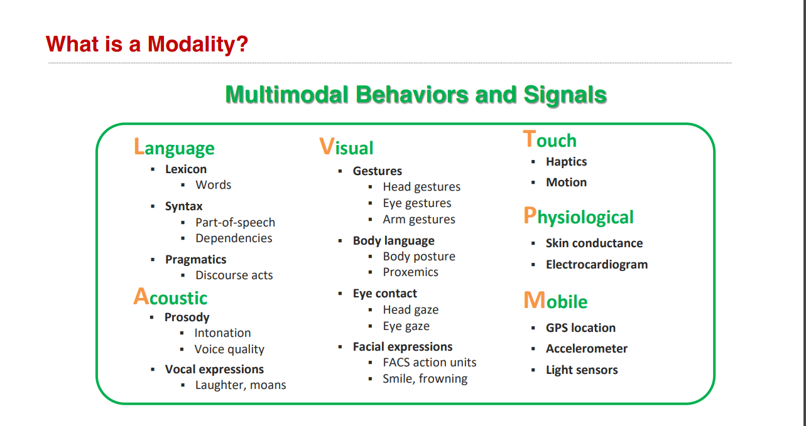

# Awesome Project第7期

## Course

### AI教程

- 链接：https://space.bilibili.com/3129054/channel/collectiondetail?sid=874339
  
- 介绍：​​​ OpenAI 大神 Andrej Karpathy 录制的AI相关课程视频，主要包括神经网络和反向传播构建、语言建模的详细介绍、在代码中构建GPT、大语音模型介绍等等。

- 推荐指数：⭐️⭐️⭐️⭐️⭐️

### ICML2023_Tutorial on Multimodal Machine Learning

- 获取方式：公众号回复【R197】获取pDF
  
- 介绍：​CMU 两位学者在 ICML 2023 的分享，主要内容是​多模态机器学习的基础知识和前沿进展。包含多模态的定义、多模态的核心技术挑战、表示 (Representation) 的子挑战、对齐 (Alignment) 的子挑战、未来的研究方向 (Future Directions)等。

- 推荐指数：⭐️⭐️⭐️⭐️⭐️

## Tools

### 发现最新最佳AI产品

- 链接：https://top.aibase.com/
  
- 介绍：​​AI产品聚合网站，包含了10064+个最佳人工智能产品和服务，每日持续更新，覆盖图像处理、视频创作、效率助手、写作灵感、艺术灵感、趣味、开发编程、聊天机器人、医疗健康、翻译等多个领域。

- 推荐指数：⭐️⭐️⭐️⭐️⭐️

### Awesome Free ChatGPT

- 链接：https://github.com/LiLittleCat/awesome-free-chatgpt
  
- 介绍：该项目收录了免费的 ChatGPT 镜像网站列表，目前已收录了200多个平替网站。

- 推荐指数：⭐️⭐️⭐️⭐️⭐️

## LLM

### LLMs九层妖塔

- 链接：https://github.com/km1994/LLMsNineStoryDemonTower
  
- 介绍：​该项目分享 LLMs在自然语言处理（ChatGLM、Chinese-LLaMA-Alpaca、小羊驼 Vicuna、LLaMA、GPT4ALL等）、信息检索（langchain）、语言合成、语言识别、多模态等领域（Stable Diffusion、MiniGPT-4、VisualGLM-6B、Ziya-Visual等）等 实战与经验。

- 推荐指数：⭐️⭐️⭐️⭐️⭐️

### llm大模型训练专栏

- 链接：https://www.zhihu.com/column/c_1252604770952642560
  
- 介绍：​​该项目提供了一系列LLM前言理论和实战实验，包括论文解读与洞察分析。

- 推荐指数：⭐️⭐️⭐️⭐️⭐️

### Awesome-Domain-LLM

- 链接：https://github.com/luban-agi/Awesome-Domain-LLM
  
- 介绍：​该项目收集和梳理垂直领域的开源模型、数据集及评测基准。

- 推荐指数：⭐️⭐️⭐️⭐️⭐️

### DecryptPrompt

- 链接：https://github.com/DSXiangLi/DecryptPrompt
  
- 介绍：该项目​​总结了Prompt&LLM论文，开源数据&模型，AIGC应用。内容包括但不限于：提示工程（prompt engineering）、零/少样本学习、思维链（chain of thought）、模型训练、评估、可靠性优化、知识编辑等方面的研究和应用。

- 推荐指数：⭐️⭐️⭐️⭐️⭐️

## NLP

### Awesome Pretrained Chinese NLP Models

- 链接：https://github.com/lonePatient/awesome-pretrained-chinese-nlp-models
  
- 介绍：在自然语言处理领域中，预训练语言模型（Pretrained Language Models）已成为非常重要的基础技术，本仓库主要收集目前网上公开的一些高质量中文预训练模型、中文多模态模型、中文大语言模型等内容

- 推荐指数：⭐️⭐️⭐️⭐️⭐️