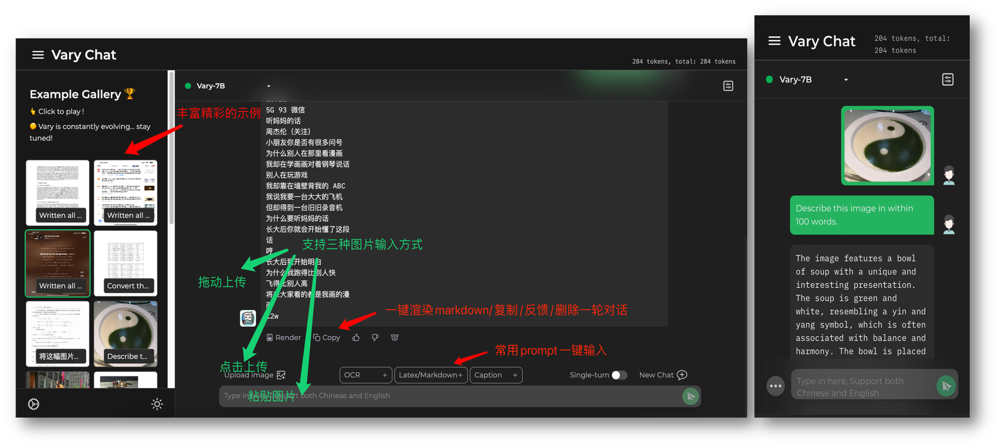

# Awesome Project第8期

## LLM

### LLM-Zoo

- 链接：https://github.com/DAMO-NLP-SG/LLM-Zoo 
  
- 介绍：​​​ 该项目收集了包括开源和闭源的LLM模型，具体包括了发布时间，模型大小，支持的语种，领域，训练数据及相应论文/仓库等。

- 推荐指数：⭐️⭐️⭐️⭐️⭐️

### LLMs-In-China

- 链接：https://github.com/wgwang/LLMs-In-China 

- 简介：该项目旨在记录中国大模型发展情况，同时持续深度分析开源开放的大模型以及数据集的情况。

- 推荐指数：⭐️⭐️⭐️⭐️⭐️

### BMList

- 链接：https://github.com/OpenBMB/BMList 

- 简介：该项目收集了参数量超过10亿的大模型，并梳理了各个大模型的适用模态、发布的机构、适合的语种，参数量和开源地址、API等信息

- 推荐指数：⭐️⭐️⭐️⭐️⭐️

### GPTs

- 链接：https://github.com/linexjlin/GPTs
  
- 介绍：该仓库收集了泄露的 GPT 提示。

- 推荐指数：⭐️⭐️⭐️⭐️⭐️

### CLoT

- 链接：https://github.com/sail-sg/CLoT
  
- 介绍：探讨了如何提高大型语言模型（LLMs）在创意任务中的“跳跃思维”（Leap-of-Thought, LoT）能力。提出了创造性跳跃思维（Creative LoT, CLoT）框架，包括可关联指令调优阶段和探索性自精化阶段。前者将Oogiri-GO数据集转化为指令调优数据，以提升LLM的LoT能力；后者则让LLM在弱关联条件下生成更多创意LoT数据，并通过筛选高质量数据进行自精化。

- 推荐指数：⭐️⭐️⭐️⭐️⭐️

## 多模态

### Vary

- 链接：https://github.com/Ucas-HaoranWei/Vary
  
- 介绍：一套视觉感知上限极高的通用多模态框架,Vary充分探索了视觉词表对感知能力的影响，提供了一套有效的视觉词表扩充方法。通过在公开数据集以及我们渲染的文档图表数据上训练，在保持vanilla多模态能力的同时，还激发出了端到端的中英文图片、公式截图和图表理解能力。

- 推荐指数：⭐️⭐️⭐️⭐️⭐️

