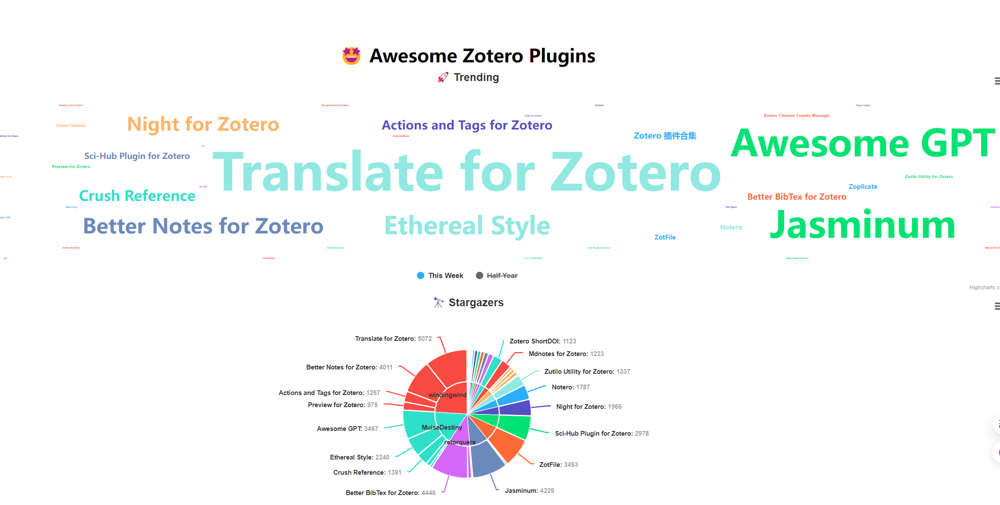

# Awesome Project第9期

## Tools

### AI图片处理神器inpaint-web

- 链接： https://github.com/lxfater/inpaint-web

- 在线体验地址：https://inpaintweb.lxfater.com
  
- 介绍：​​​ 基于 Webgpu 技术和 wasm 技术的免费开源 inpainting & image-upscaling 工具, 纯浏览器端实现。不仅能快速去水印，还能将模糊的图片变成高分辨率清晰图片。

- 推荐指数：⭐️⭐️⭐️⭐️

### Zotero插件

- 链接： https://zotero-chinese.com/

- 介绍：​​Zotero Chinese主要维护一些与 Zotero 有关的中文文档、资料以及程序，提供很多好用的zotero插件。

- 推荐指数：⭐️⭐️⭐️⭐️⭐️

## LLM

### RAG 综述 
 
- 链接： https://arxiv.org/abs/2312.10997

- 介绍：​​​这篇文章主要讨论了检索增强生成（RAG）的技术。RAG是一种结合了检索和生成的方法，它通过从大量的知识库中检索相关信息，然后用这些信息来生成回答，
  从而提高了回答的准确性和可靠性。文章首先介绍了RAG的背景，包括其定义、与细调（fine-tuning）的比较等。然后，文章详细介绍了RAG的三个主要阶段：预训练、细调和推理。
  在预训练阶段，RAG通过检索增强的方法来提高预训练语言模型的性能；在细调阶段，RAG通过细调检索器和生成器来进一步提高性能；在推理阶段，RAG通过在生成过程中引入检索内容来提高生成质量。
  文章还讨论了RAG的评估方法，包括独立评估和端到端评估。最后，文章探讨了RAG的未来发展方向，包括垂直优化、水平扩展和生态系统建设。

- 推荐指数：⭐️⭐️⭐️⭐️⭐️

## Course
### 2024 年学习生成式 AI 路线图

- 链接： https://github.com/krishnaik06/Roadmap-To-Learn-Generative-AI-In-2024

- 介绍：​​​介绍了生成式AI的学习路线。主要分为Python编程基础、机器学习自然语言处理基础、基础深度学习概念、高级NLP概念、
    开启生成式人工智能之旅（GPT4、Mistral 7B、LLAMA、Hugging Face 开源 LLM 模型、Google Palm 模型）、矢量数据库和矢量存储、LM项目的部署等，列出了YouTube视频和文字链接。

- 推荐指数：⭐️⭐️⭐️⭐️⭐️

### 学会与 GitHub Copilot 进行 AI 结对编程

- 链接： https://github.com/microsoft/Mastering-GitHub-Copilot-for-Paired-Programming

- 介绍：​​​这是一个 6 课时的课程，教授有关利用 GitHub Copilot 和 AI 配对编程资源所需了解的所有信息。主要包括GitHub 简介、GitHub Copilot 简介、使用 GitHub Copilot 与 JavaScript、
  使用 GitHub Copilot 与 Python、使用 GitHub Copilot 创建迷你游戏。

- 推荐指数：⭐️⭐️⭐️

## 其他

### Big ideas in tech in 2024

- 链接：https://gamma.app/public/Big-Ideas-in-tech-in-2024-by-A16Z-phquomraxnzc1fs?mode=doc 

- 介绍：这个网站是关于Andreessen Horowitz（A16Z）发布的2024年科技大趋势的报告。报告中列出了A16Z认为将在2024年影响科技行业的一些重要趋势和创新。这些趋势涵盖了多个领域，
  包括人工智能、生物技术、加密货币、能源、量子计算等。报告详细分析了每个趋势的潜在影响和商业机会，并提供了一些具体的案例研究。此外，报告还讨论了这些趋势可能带来的挑战和风险。
  为读者提供了一个全面而深入的视角，以理解未来几年科技行业的可能发展方向。

- 推荐指数：⭐️⭐️⭐️⭐️⭐️

### 用 RAGAs（检索增强生成评估）评估 RAG（检索增强型生成）应用 [译]

- 链接： https://baoyu.io/translations/rag/evaluating-rag-applications-with-ragas?continueFlag=5d10d34c97637bebcfeba6470c0f0d9b

- 介绍：​​​RAGAs框架提供了一种无需参照标准的评估方法，主要依赖于大语言模型（LLM）来评估RAG应用的组件和整体性能。文章详细解释了如何准备评估数据和使用RAGAs工具进行评估，并讨论了评估结果的解读。

- 推荐指数：⭐️⭐️⭐️⭐️