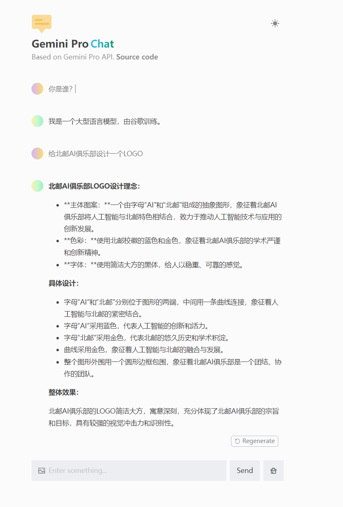
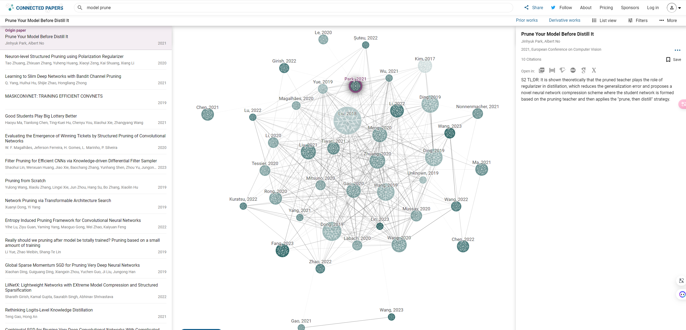
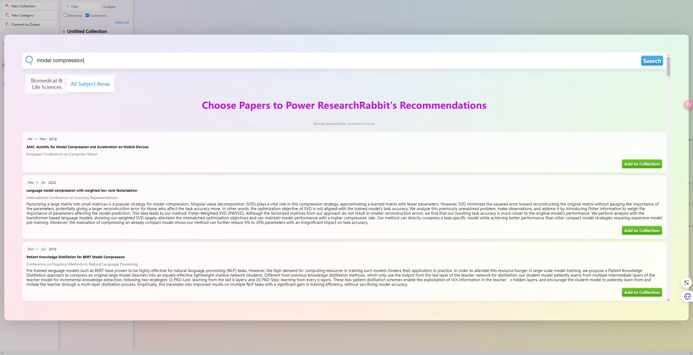
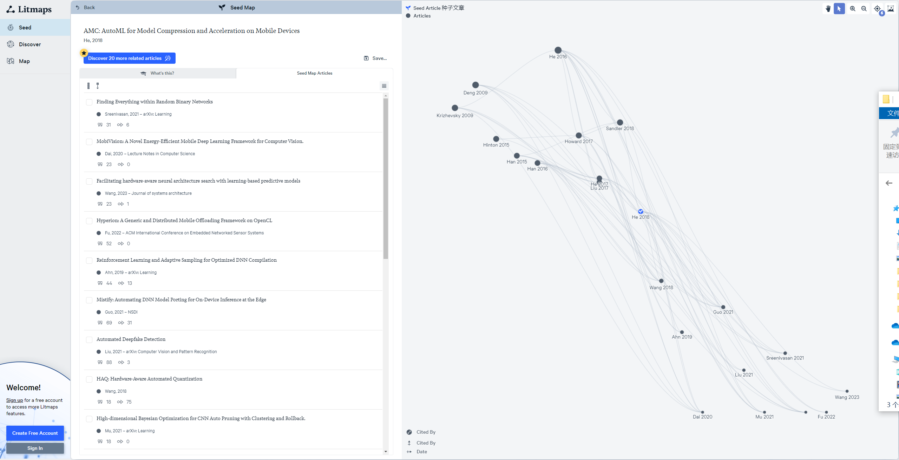
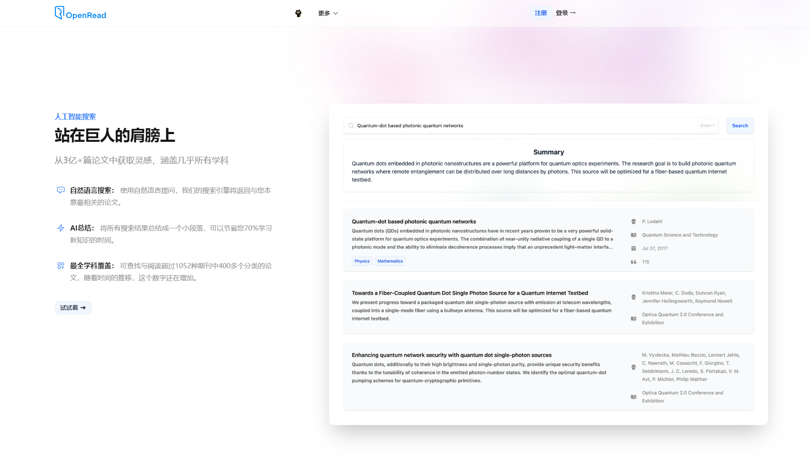
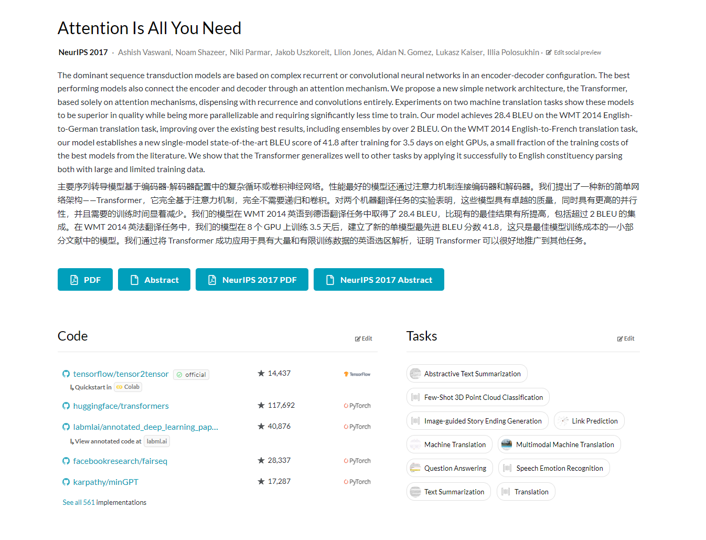

# Awesome Project第10期

## Tools

### 一键部署大模型

- 链接： https://github.com/ConnectAI-E/Awesome-One-Click-Deployment
  
- 介绍：​​​ 一键部署各种Github开源AI项目，只需要在界面上点点点，专属于自己的AI应用就部署完成了，真的是有手就行。目前支持GeminiProChat、AutoGPT-Next-Web、wechat-chatgpt、chatbot-ui等项目，如图所示，可以创建一个自己的 Gemini Pro 大模型，无需额外服务器。

- 在线体验地址：https://gemini-pro-chat-git-main-ironartisans-projects.vercel.app

- 推荐指数：⭐️⭐️⭐️⭐️⭐️

### 沉浸式翻译

- 链接： https://immersivetranslate.com/
  
- 介绍：​​​ 非常受欢迎的双语对照网页翻译插件，可以完全免费地使用它来实时翻译外语网页，PDF文档，ePub 电子书，字幕文件等。在手机上也可以随时随地用哦，支持10种以上的翻译服务，支持对 PDF 做对照翻译，可以加速论文的阅读效率。

- 推荐指数：⭐️⭐️⭐️⭐️⭐️

### 论文知识网络

- 链接1： https://www.connectedpapers.com

- 链接2：https://www.researchrabbit.ai

- 链接3：https://www.litmaps.com

- 介绍：​​​ 将搜索出来论文的依赖和被依赖项以知识网络的形式全部呈现出来

- 推荐指数：⭐️⭐️⭐️⭐️⭐️

### OpenRead

- 链接： https://www.openread.academy/zh
  
- 介绍：​​​ OpenRead是一个创新的学术研究平台，它通过人工智能技术为用户提供了一个全面的学术资源库，包括超过3亿篇论文，覆盖广泛的学科领域。用户可以通过自然语言搜索快速找到相关论文，并通过AI总结功能快速把握论文核心内容。此外，OpenRead还提供了阅读与笔记管理工具，如AI论文浓缩、AI问答和论文关系网，帮助用户高效地整理和理解复杂知识。平台鼓励学术社区的建立，通过高校联盟促进知识的自由流通。OpenRead的目标是简化研究流程，让用户能够专注于知识的探索和创新，而不受传统学术出版和研究工具的限制。

- 推荐指数：⭐️⭐️⭐️⭐️⭐️

### paperswithcode

- 链接： https://paperswithcode.com/
  
- 介绍：​​​ Papers With Code 是一个专注于机器学习领域的在线平台，它提供了最新的研究论文、代码实现、数据集和方法。这个平台旨在帮助研究人员和开发者了解和跟踪机器学习领域的最新进展，包括但不限于图像生成、自然语言处理、计算机视觉等方向。在找论文代码的时候经常用到，推荐！

- 推荐指数：⭐️⭐️⭐️⭐️⭐️

### 在线交互式教学工具

- 链接： https://github.com/ronreiter/interactive-tutorials?tab=readme-ov-file
  
- 介绍：​​​ 帮助你学习各类编程语言的在线交互式教学工具，背后使用的是 Sphere Engine，支持直接编译和运行各类语言代码，省却了本地安装环境的麻烦。目前支持的语言有Python、Java、Html、C、CPP、JS、PHP、Shell、C#、Perl、Ruby、Golang、Rust等。

- 推荐指数：⭐️⭐️⭐️⭐️⭐️

