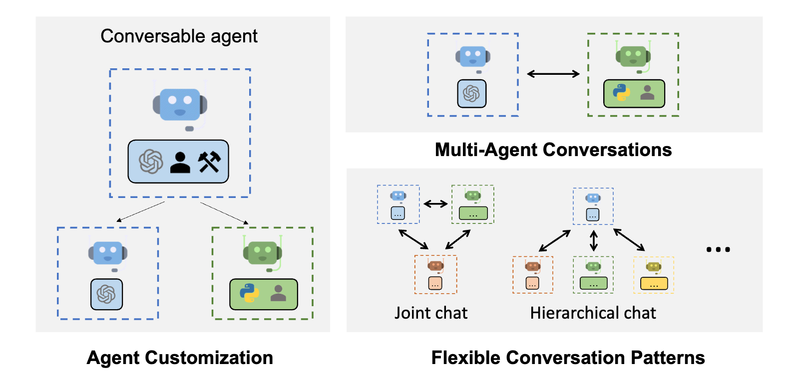
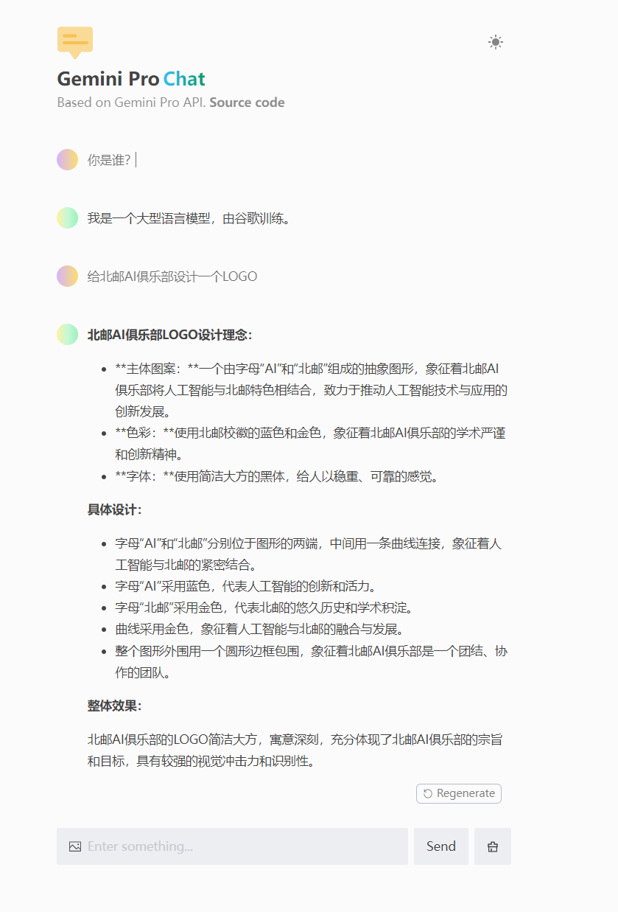
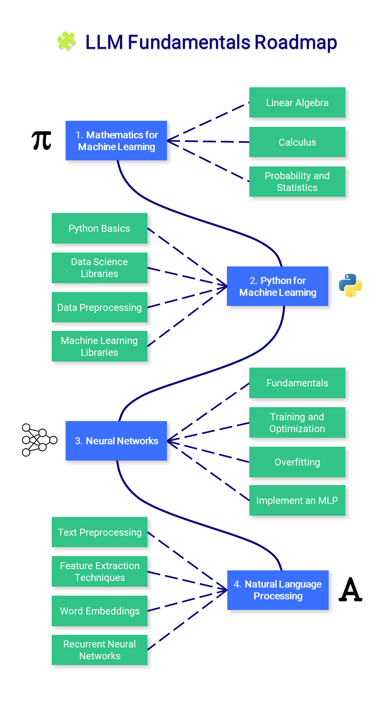

# Awesome Project第11期

## LLM

### Stanford Alpaca

- 链接： https://github.com/tatsu-lab/stanford_alpaca
  
- 介绍：​​​ 用于训练斯坦福大学羊驼模型并生成数据的代码和文档。Alpaca模型是一种大型语言模型，专注于提供更高效的文本生成和处理能力。项目旨在促进语言模型的研究与开发。

- 推荐指数：⭐️⭐️⭐️⭐️⭐️

### OpenLLaMA

- 链接：https://github.com/openlm-research/open_llama
  
- 介绍：​​​ OpenLLaMA是Meta AI的LLaMA 7B的一个开源复现项目，使用RedPajama数据集进行训练。提供一个与LLaMA 7B模型相似的开源版本，提供预训练 OpenLLaMA 模型的 PyTorch 和 JAX 权重，以及评估结果以及与原始 LLaMA 模型的比较。

- 推荐指数：⭐️⭐️⭐️⭐️⭐️

### AutoGen

- 链接： https://github.com/microsoft/autogen
  
- 介绍：​​​ AutoGen是由微软开发的基于多智能体的大规模语言模型应用开发框架，提供了一套工具和框架以简化和加速基于大型语言模型的应用开发和部署。

- 推荐指数：⭐️⭐️⭐️⭐️⭐️

### 大型语言模型实用指南

- 链接： https://github.com/Mooler0410/LLMsPracticalGuide
  
- 介绍：​​​ LLMs Practical Guide是一个精心整理的大型语言模型(LLM)实用指南资源列表，包括LLM Tree、示例和论文。这个项目旨在为研究者和开发者提供关于大型语言模型的实践资源，比如使用方法、最佳实践和相关研究论文，助力于理解和运用大型语言模型。

- 推荐指数：⭐️⭐️⭐️⭐️⭐️

## 多模态

### Awesome Multimodal Large Language Models

- 链接： https://github.com/BradyFU/Awesome-Multimodal-Large-Language-Models
  
- 介绍：​​​ 汇集了关于多模态大型语言模型的最新论文和数据集，以及它们的评估方法。

- 推荐指数：⭐️⭐️⭐️⭐️⭐️

## 工具

### 一键部署大模型

- 链接： https://github.com/ConnectAI-E/Awesome-One-Click-Deployment
  
- 介绍：​​​ 一键部署各种Github开源AI项目，只需要在界面上点点点，专属于自己的AI应用就部署完成了，真的是有手就行。目前支持GeminiProChat、AutoGPT-Next-Web、wechat-chatgpt、chatbot-ui等项目，如图所示，可以创建一个自己的 Gemini Pro 大模型，无需额外服务器。

- 在线体验地址：https://gemini-pro-chat-git-main-ironartisans-projects.vercel.app

- 推荐指数：⭐️⭐️⭐️⭐️⭐️

### JARVIS

- 链接： https://github.com/microsoft/JARVIS
  
- 介绍：​​​ 一个将LLM与机器学习社区联系起来的系统。JARVIS 的使命是探索通用人工智能 (AGI) 并向整个社区提供前沿研究成果,介绍了如何利用大型语言模型来提升机器学习任务的性能和效率。

- 推荐指数：⭐️⭐️⭐️⭐️⭐️

### 在线交互式教学工具

- 链接： https://github.com/ronreiter/interactive-tutorials?tab=readme-ov-file
  
- 介绍：​​​ 帮助你学习各类编程语言的在线交互式教学工具，背后使用的是 Sphere Engine，支持直接编译和运行各类语言代码，省却了本地安装环境的麻烦。目前支持的语言有Python、Java、Html、C、CPP、JS、PHP、Shell、C#、Perl、Ruby、Golang、Rust等。

- 推荐指数：⭐️⭐️⭐️⭐️⭐️

## 课程

### 大模型课程llm-course

- 链接： https://github.com/mlabonne/llm-course
  
- 介绍：​​​ LLM课程分为三个部分：（1）LLM 基础知识涵盖有关数学、Python 和神经网络的基本知识；（2）LLM科学家专注于学习如何使用最新技术建立最好的LLM；（3）LLM工程师专注于如何创建基于LLM的解决方案并部署它们。目前Github Star已达8K,强推！！！

- 推荐指数：⭐️⭐️⭐️⭐️⭐️

