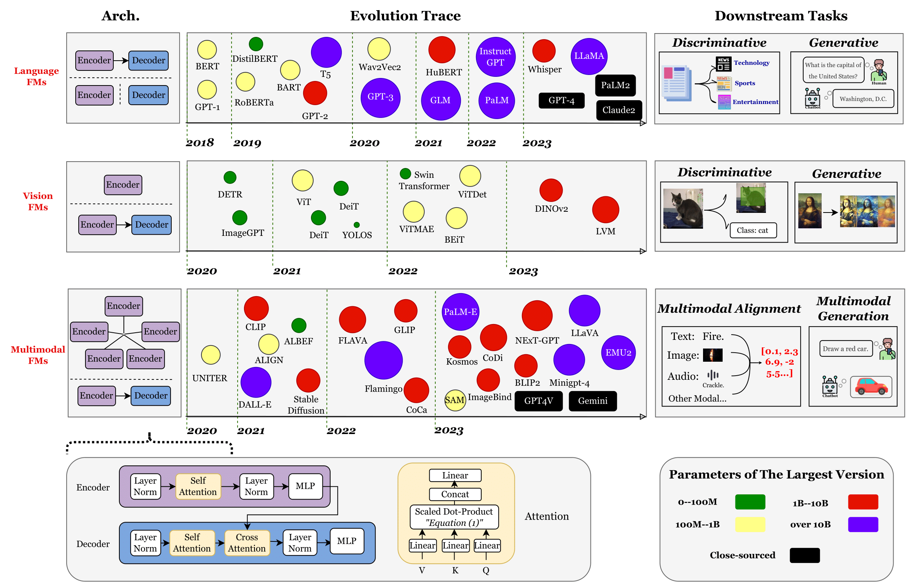
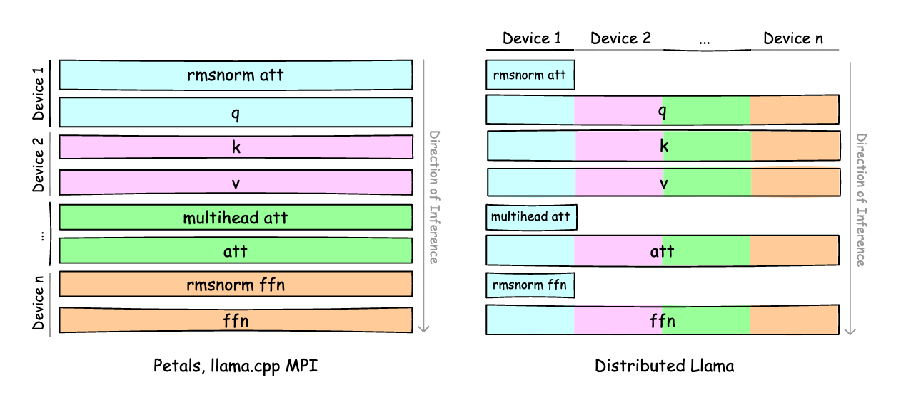
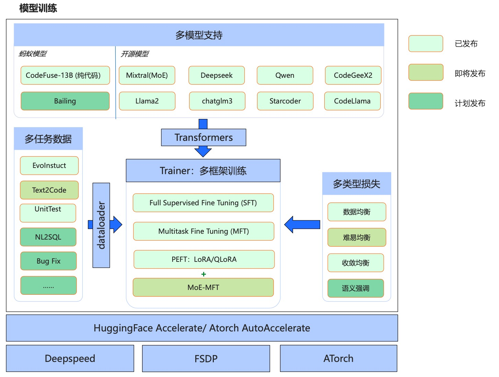

# Awesome Project第14期

## 深度学习

### ML-Papers-of-the-Week

- 链接：https://github.com/dair-ai/ML-Papers-of-the-Week
  
- 介绍：​​​ 来自DAIR.AI团队，每周重点介绍顶级 ML 论文，推荐！！！

- 推荐指数：⭐️⭐️⭐️⭐️⭐️

## LLM

### Inferflow

- 链接：https://github.com/inferflow/inferflow
  
- 介绍：​​​ Inferflow 是一种高效且高度可配置的大型语言模型推理引擎。使用Inferflow，用户只需修改相应配置文件中的一些行即可服务于大多数常见的Transformer模型，而无需编写一行源代码。Inferflow实现2位、3位、3.5位、4位、5位、6位和8位量化。在量化方案中，3.5位量化是Inferflow推出的新方案。支持多GPU推理，具有三种模型分区策略可供选择：按层分区（管道并行）、按张量分区（张量并行）和混合分区（混合并行）。其他推理引擎很少支持混合分区。支持三种类型的Transformer模型：仅解码器模型、仅编码器模型和编码器-解码器模型。

- 推荐指数：⭐️⭐️⭐️⭐️⭐️

### Efficient LLM and Multimodal Foundation Model Survey

- 链接：https://github.com/UbiquitousLearning/Efficient_Foundation_Model_Survey
  
- 介绍：​​​ 高效LLM和多模态基础模型相关论文资源列表，包括大型语言模型(LLM)、视觉Transformer(ViT)、扩散和LLM基础的多模态模型，它们如何在机器学习生命周期的各个阶段，从训练到部署。包含2020年以后发表的论文，范围为CS顶级会议上发表的论文，即CSRankings中收录的论文。此外，还从 arXiv 中手动挑选相关且可能具有高影响力的论文。

- 推荐指数：⭐️⭐️⭐️⭐️⭐️

### DataTrove

- 链接：https://github.com/huggingface/datatrove
  
- 介绍：​​​ DataTrove 是一个用于大规模处理、过滤和删除重复文本数据的库。它提供了一组预构建的常用处理块以及一个框架，可以轻松添加自定义功能。DataTrove 处理管道与平台无关，可以在本地或 slurm 集群上开箱即用。其（相对）较低的内存使用率和多步骤设计使其非常适合大型工作负载，例如处理 LLM 的训练数据。

- 推荐指数：⭐️⭐️⭐️⭐️⭐️

### Distributed Llama

- 链接：https://github.com/b4rtaz/distributed-llama
  
- 介绍：​​​ Distributed Llama在较弱的设备上运行 LLMs 或通过分配工作负载和划分 RAM 使用量使功能强大的设备变得更加强大。该项目证明可以将 LLMs 的工作负载分散到多个设备上并实现显着的加速。分布式 Llama 允许您在内部运行大型 LLMs。该项目使用 TCP 套接字来同步状态。您可以使用家庭路由器轻松配置您的AI集群。目前已支持模型有Llama 2 7B、Llama 2 13B、Llama 2 70B。

- 推荐指数：⭐️⭐️⭐️⭐️⭐️

### MFTCoder

- 链接：https://github.com/codefuse-ai/MFTCoder
  
- 介绍：​​​ Codefuse-MFTCoder 是一个开源的多任务代码大语言模型项目，包含代码大模型的模型、数据、训练等。是国际首个高精度、高效率、多任务、多模型支持、多训练算法，大模型代码能力微调框架；既支持主流开源的Accelerate+DeepSpeed/FSDP，也支持新开源的ATorch 框架；一个模型同时支持多个任务，会保证多个任务之间的平衡，甚至可以泛化到新的没有见过的任务上去；支持最新的多个开源模型，包括gpt-neox，llama，llama-2，baichuan，Qwen，chatglm2等；支持LoRA和QLoRA，可以用很少的资源去微调很大的模型，且训练速度能满足几乎所有微调场景。

- 推荐指数：⭐️⭐️⭐️⭐️⭐️

### RTP-LLM

- 链接：https://github.com/alibaba/rtp-llm
  
- 介绍：​​​ rtp-llm 是阿里巴巴大模型预测团队开发的 LLM 推理加速引擎。rtp-llm 在阿里巴巴内部被广泛使用，支持了包括淘宝、天猫、菜鸟、高德、饿了么、AE、Lazada 等多个部门的大模型推理业务。支持剪枝后的不规则模型加载；支持多轮对话上下文 Cache；支持 Speculative Decoding 加速；支持 Medusa 加速；和流行的HuggingFace模型无缝对接，支持多种权重格式。无需额外转换流程；为用户提供高性能、低成本、易用的推理服务，帮助客户和开发者量身定做适合自身业务的推理服务，助力业务增长。

- 推荐指数：⭐️⭐️⭐️⭐️⭐️

## AI应用

### 哄哄模拟器Web版

- 链接：https://hong.greatdk.com
  
- 介绍：​​​ 哄哄模拟器基于AI技术，你需要使用语言技巧和沟通能力，在限定次数内让对方原谅你，直男必备，快去练习哄你的女朋友吧！女朋友在哪？快去new一个!

- 推荐指数：⭐️⭐️⭐️⭐️⭐️

