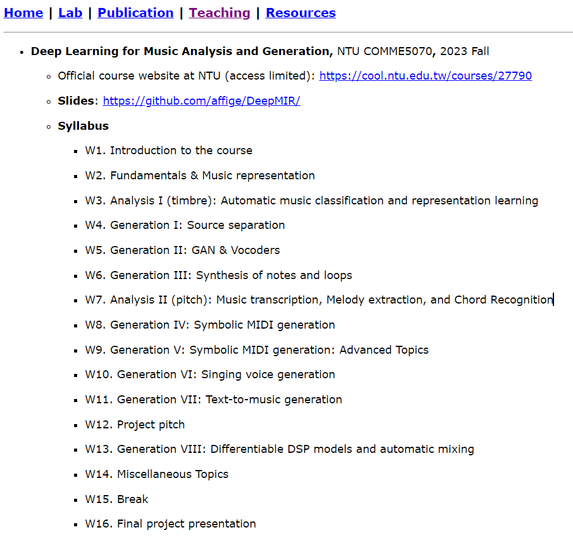

# Awesome Project第15期

## AI教程

###  Stable Diffusion教程

- 链接：https://course.fast.ai/Lessons/part2.html
  
- 介绍：​​fast.ai 是全球知名的AI学习网站，该课程的作者是Jeremy Howard ，fast.ai 的创始人，曾任 Kaggle 首席科学家、Etsy数据科学家等职位。 本课程提供30小时以上的视频教学，深入讲解从基础开始实现稳定扩散算法。这一技术曾引发互联网热议，被媒体评价为可能改变人们对网络信息真实性的认知。课程与Stable.ai和Hugging Face的专家合作，确保内容紧跟最新技术进展。除了涵盖Stable Diffusion发布后的论文，课程还教授如何阅读和实践研究论文，帮助学员提升学术研究能力。

- 推荐指数：⭐️⭐️⭐️⭐️⭐️

### Deep Learning for Music Analysis and Generation

- 链接：https://github.com/affige/DeepMIR
  
- 介绍：​台大教授的课程《音乐分析与生成的深度学习》教材（2023年秋季），主要是通过深度学习技术解决与音乐相关的各种问题。第一部分是音乐音频信号的分析，涵盖音乐音频的特征提取和表示学习、音乐音频分类、旋律提取、自动音乐转录和音乐源分离等主题。第二部分是关于音乐素材的生成，包括符号域 MIDI 或指法谱，以及音频域音乐信号，例如歌声和器乐。这将涉及深度生成模型，例如生成对抗网络（GAN）、变分自动编码器（VAE）、Transformer和扩散模型。

- 推荐指数：⭐️⭐️⭐️⭐️⭐️

## LLM

### llm-books

- 链接：https://github.com/morsoli/llm-books
  
- 介绍：​​本项目是一个利用LLM构建应用实践笔记。内容包含大语言模型概述、LangChain入门、LlamaIndex 概述、HuggingGPT 实现、LLMOps 专题、Agent 专题及基于大型语言模型的生成式AI。本电子书内容是作者在学习开发基于大语言模型的应用过程中，总结出来的一些经验和方法以及接触到的一些资源，采用理论学习和代码实践相结合的形式。理论学习部分由Langchain、LlamaIndex等开源工具文档、一些最佳实践的技术博客、论文阅读三部分组成。在每个工具的理论学习结束后，辅以实践性代码帮助理解。最后会将各个模块整合起来实现一个信息处理系统。

- 推荐指数：⭐️⭐️⭐️⭐️⭐️

### OLMo

- 论文：https://allenai.org/olmo/olmo-paper.pdf
- 权重：https://huggingface.co/allenai/OLMo-7B
- 代码：https://github.com/allenai/OLMo
- 数据：https://huggingface.co/datasets/allenai/dolma
- 评估：https://github.com/allenai/OLMo-Eval
- 适配：https://github.com/allenai/open-instruct

- 介绍：​​艾伦人工智能研究所等5机构最近公布了第一个开源语言模型OLMo，包含建模、训练、评估和推理等代码。这是第一个真·完全开源的大模型，几乎将从零开始训练一个大模型过程中的一切数据和资料都开源了，强烈推荐！
- 推荐指数：⭐️⭐️⭐️⭐️⭐️

### MiniCPM: 揭示端侧大语言模型的无限潜力

- 链接：https://github.com/OpenBMB/MiniCPM
  
- 介绍：​​MiniCPM 是面壁智能与清华大学自然语言处理实验室共同开源的系列端侧大模型，主体语言模型 MiniCPM-2B 仅有 24亿（2.4B）的非词嵌入参数量。完全开源MiniCPM-2B的模型参数供学术研究和有限商用，在未来还将发布训练过程中的所有Checkpoint和大部分非专有数据供模型机理研究。
  - 经过 SFT 后，MiniCPM 在公开综合性评测集上，MiniCPM 与 Mistral-7B相近（中文、数学、代码能力更优），整体性能超越 Llama2-13B、MPT-30B、Falcon-40B 等模型。
  - 经过 DPO 后，MiniCPM 在当前最接近用户体感的评测集 MTBench上，MiniCPM-2B 也超越了 Llama2-70B-Chat、Vicuna-33B、Mistral-7B-Instruct-v0.1、Zephyr-7B-alpha 等众多代表性开源大模型。
  - 以 MiniCPM-2B 为基础构建端侧多模态大模型 MiniCPM-V，整体性能在同规模模型中实现最佳，超越基于 Phi-2 构建的现有多模态大模型，在部分评测集上达到与 9.6B Qwen-VL-Chat 相当甚至更好的性能。
  - 经过 Int4 量化后，MiniCPM 可在手机上进行部署推理，流式输出速度略高于人类说话速度。MiniCPM-V 也直接跑通了多模态大模型在手机上的部署。
  - 一张1080/2080可高效参数微调，一张3090/4090可全参数微调，一台机器可持续训练 MiniCPM，二次开发成本较低。

- 推荐指数：⭐️⭐️⭐️⭐️⭐️

### OmniLMM

- 链接：https://github.com/OpenBMB/OmniLMM
  
- 介绍：​​OmniLMM 是面向图文理解的开源多模态大模型系列。该系列模型接受图像和文本输入，并提供高质量的文本输出。目发布了两个版本的 OmniLMM，旨在实现领先的性能和高效的部署：OmniLMM-12B：相比同规模其他模型在多个基准测试中具有领先性能。OmniLMM-3B：可在终端设备上部署并具备先进的多模态对话能力。

- 推荐指数：⭐️⭐️⭐️⭐️⭐️

### Autonomous Agents

- 链接：https://github.com/tmgthb/Autonomous-Agents
  
- 介绍：长期以来，自主Agent一直被视为通向通用人工智能（AGI）的一条有前途的道路，能够通过自我指导的规划和指令来完成任务。大型语言模型（LLMs）取得了巨大的成功，表明它们具有实现类人智能的潜力。在这种能力的推动下，近年来出现了一种新兴趋势，其中LLMs被用作创建自主Agent的核心协调器，这种战略性的应用旨在模仿类人的决策过程，从而为更复杂和适应性更强的人工智能系统提供一条途径。​​本项目收录了自主Agent(LLM)相关论文列表，每天均会更新。

- 推荐指数：⭐️⭐️⭐️⭐️⭐️
  

### awesome-humanoid-learning

- 链接：https://github.com/jonyzhang2023/awesome-humanoid-learning
  
- 介绍：​​项目收录了与人形机器人学习相关的资源精选列表。鉴于人形机器人和双足机器人运动的相似性，也收录了一些关于双足运动的工作以供参考。

- 推荐指数：⭐️⭐️⭐️⭐️⭐️
