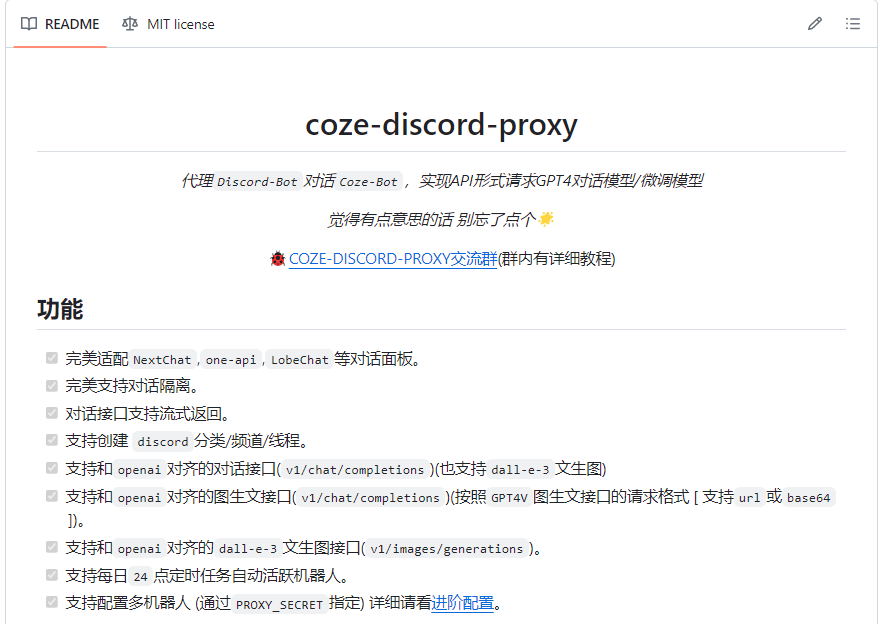

# Awesome Project第16期

## LLM

### Awesome-Medical-Large-Language-Models

- 链接：https://github.com/burglarhobbit/Awesome-Medical-Large-Language-Models
  
- 介绍：​​本项目收录了医疗保健和医疗领域相关大型语言模型的精选论文，分为大型语言模型、大型视觉模型、综述论文+临床研究三部分，感兴趣的同学可以查看。

- 推荐指数：⭐️⭐️⭐️⭐️⭐️

### SegMoE: Segmind Mixture of Diffusion Experts

- 链接：https://github.com/segmind/segmoe
  
- 介绍：​​SegMoE 是一个强大的框架，无需训练即可在几分钟内动态地将稳定扩散模型组合成专家混合物。该框架允许动态创建更大的模型，从而提供更多的知识、更好的依从性和更好的图像质量。它的灵感来自 mergekit 的 mixtral 分支，但适用于稳定扩散模型。

- 推荐指数：⭐️⭐️⭐️⭐️⭐️

### Qwen1.5

- 链接：https://github.com/QwenLM/Qwen1.5
  
- 介绍：​​Qwen1.5是阿里云Qwen团队开发的大型语言模型系列Qwen的改进版本。Qwen升级到Qwen1.5，即Qwen2的测试版。与 Qwen 类似，它仍然是一个仅解码器的 Transformer 模型，具有 SwiGLU 激活、RoPE、多头注意力。具有0.5B、1.8B、4B、7B、14B、72B六种型号大小的模型，所有模型都支持 32768 标记的上下文长度。

- 推荐指数：⭐️⭐️⭐️⭐️⭐️

### coze-discord-proxy

- 链接：https://github.com/deanxv/coze-discord-proxy
  
- 介绍：​字节跳动 Coze 可以免费使用 GPT-4,​代理Discord-Bot对话Coze-Bot，实现API形式请求GPT4对话模型/微调模型。

- 推荐指数：⭐️⭐️⭐️⭐️⭐️

### Tabular LLM：构建面向表格智能任务的大型语言模型

- 链接：https://github.com/SpursGoZmy/Tabular-LLM
  
- 介绍：​​本项目旨在收集开源的表格智能任务数据集（比如表格问答、表格-文本生成等），将原始数据整理为指令微调格式的数据并微调LLM，进而增强LLM对于表格数据的理解，最终构建出专门面向表格智能任务的大型语言模型。

- 推荐指数：⭐️⭐️⭐️⭐️⭐️

### Embedchain

- 链接：https://github.com/embedchain/embedchain
  
- 介绍：​​Embedchain 是一个开源 RAG 框架，可以轻松创建和部署 AI 应用程序。 Embedchain 的核心遵循“常规但可配置”的设计原则，为软件工程师和机器学习工程师服务。Embedchain 简化了检索增强生成 (RAG) 应用程序的创建，为管理各种类型的非结构化数据提供了无缝流程。它有效地将数据分割成可管理的块，生成相关的嵌入，并将它们存储在矢量数据库中以优化检索。借助一套多样化的 API，它使用户能够提取上下文信息、找到精确的答案或进行交互式聊天对话，根据自己的数据量身定制。

- 推荐指数：⭐️⭐️⭐️⭐️⭐️

### Ragas

- 链接：https://github.com/explodinggradients/ragas
  
- 介绍：​​Ragas 是一个框架，可帮助您评估检索增强生成 (RAG) 管道。 RAG 表示一类 LLM 应用程序，它们使用外部数据来增强 LLM 的上下文。现有的工具和框架可以帮助您构建这些管道，但对其进行评估并量化管道性能可能很困难。这就是 Ragas（RAG 评估）发挥作用的地方。Ragas 为您提供基于最新研究的工具，用于评估 LLM 生成的文本，让您深入了解 RAG 管道。 Ragas 可以与您的 CI/CD 集成，以提供持续检查以确保性能。

- 推荐指数：⭐️⭐️⭐️⭐️⭐️

### fastRAG 

- 链接：https://github.com/IntelLabs/fastRAG
  
- 介绍：​​fastRAG 是一个用于高效和优化检索增强生成管道的研究框架，结合了最先进的 LLMs 和信息检索。 fastRAG 旨在为研究人员和开发人员提供全面的工具集，以推进检索增强生成。

- 推荐指数：⭐️⭐️⭐️⭐️⭐️

### DLRover：自动分布式深度学习系统

- 链接：https://github.com/IntelLabs/fastRAG
  
- 介绍：​DLRover 使大型 AI 模型的分布式训练变得简单、稳定、快速、绿色。它可以在分布式集群上自动训练深度学习模型。它帮助模型开发人员专注于模型架构，而无需关心硬件加速、分布式运行等任何工程内容。现在，它为 K8s/Ray 上的深度学习训练作业提供自动化运维。可帮助大模型千卡训练有效时间占比超过 95%。同时具有容错性，即分布式训练在发生故障时可以继续运行；具有Flash Checkpoint特性，即分布式训练可以在几秒内从内存检查点恢复故障；还具有自动扩展性，即分布式训练可以扩展/缩减资源，以提高稳定性、吞吐量和资源利用率。
  
- 推荐指数：⭐️⭐️⭐️⭐️⭐️
