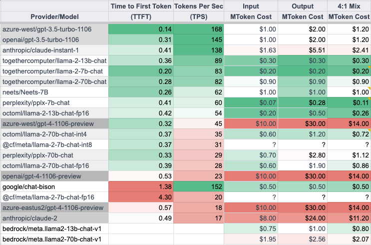

# Awesome Project第17期

## LLM

### GPTScript

- 链接：https://github.com/gptscript-ai/gptscript
  
- 介绍：​​GPTScript 是一种新的脚本语言，可自动执行与大型语言模型 (LLM)（即 OpenAI）的交互。最终目标是创建完全基于自然语言的编程体验。 GPTScript 的语法很大程度上是自然语言，因此非常容易学习和使用。自然语言提示可以与 bash 和 python 等传统脚本甚至外部 HTTP 服务调用混合。使用 GPTScript，您几乎可以执行任何操作，例如计划假期、编辑文件、运行一些 SQL 或构建 mongodb/flask 应用程序。

- 推荐指数：⭐️⭐️⭐️⭐️⭐️

### Multi-Agent-GPT

- 链接：https://github.com/YangXuanyi/Multi-Agent-GPT
  
- 介绍：​​一款基于RAG和agent构建的多模态专家助手GPT。它集成了文本、图像和音频等模态工具。支持本地部署和私有数据库建设。

- 推荐指数：⭐️⭐️⭐️⭐️⭐️

### 开源Agent框架InfiAgent

- 链接：https://github.com/InfiAgent/InfiAgent
  
- 介绍：​​InfiAgent 旨在支持从头开始构建代理演示，支持代码执行、API 调用、批量推理和沙箱管理。您可以基于InfiAgent轻松构建自己的代理。

- 推荐指数：⭐️⭐️⭐️⭐️⭐️

### ai-benchmarks

- 链接：https://github.com/fixie-ai/ai-benchmarks

- 介绍：​​该存储库包含一些用于对流行AI服务的响应延迟进行基准测试的实用程序,支持大型语言模型(LLM)如OpenAI GPT-3.5、GPT-4、Anthropic Claude 2、Google Gemini Pro和PaLM 2 Bison等

- 推荐指数：⭐️⭐️⭐️⭐️⭐️

### Web LLM

- 链接：https://github.com/mlc-ai/web-llm
  
- 介绍：​​WebLLM 是一个模块化、可定制的 JavaScript 包，可通过硬件加速将语言模型聊天直接带入 Web 浏览器。一切都在浏览器内运行，无需服务器支持，并通过 WebGPU 进行加速。可以带来很多有趣的机会，为每个人构建人工智能助手，并在享受 GPU 加速的同时实现隐私。目前已支持 Llama 2 7B/13B、Mistral 7B 和 WizadMath 等。只需要有一台 64GB 内存的设备，即可运行 Llama 2 70B 模型。

- 推荐指数：⭐️⭐️⭐️⭐️⭐️

### QAnything

- 链接：https://github.com/netease-youdao/QAnything
  
- 介绍：​网易有道开源的知识库问答引擎QAnything(Question and Answer based on Anything)，​QAnything是致力于支持任意格式文件或数据库的本地知识库问答系统，可断网安装使用。任何格式的本地文件都可以往里扔，即可获得准确、快速、靠谱的问答体验。目前已支持格式: PDF(pdf)，Word(docx)，PPT(pptx)，XLS(xlsx)，Markdown(md)，电子邮件(eml)，TXT(txt)，图片(jpg，jpeg，png)，CSV(csv)，网页链接(html)等。

- 推荐指数：⭐️⭐️⭐️⭐️⭐️

### Jan

- 链接：https://github.com/janhq/jan
  
- 介绍：​​Jan 是 ChatGPT 的开源替代品，可在您的计算机上 100% 离线运行。无需写一行代码，100% 离线本地运行主流开源大语言模型，如 Mistral、Llama、Mixtral 等，支持 Windows、Mac 和 Linux 系统安装，并且拥有高颜值且操作便捷的 UI 界面。

- 推荐指数：⭐️⭐️⭐️⭐️⭐️

## AI教程

### ML-YouTube-Courses

- 链接：https://github.com/dair-ai/ML-YouTube-Courses
  
- 介绍：由DAIR.AI索引并整理了 YouTube 上一些最好的和最新的机器学习课程。包含Machine Learning、Deep Learning、Scientific Machine Learning、Practical Machine Learning、Natural Language Processing、Computer Vision、Reinforcement Learning、Graph Machine Learning、Multi-Task Learning等几部分。

- 推荐指数：⭐️⭐️⭐️⭐️⭐️