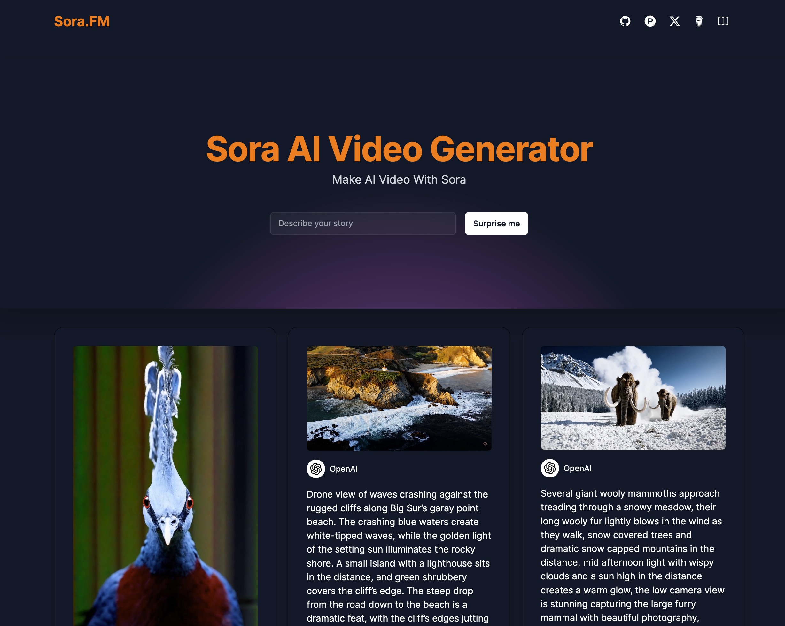
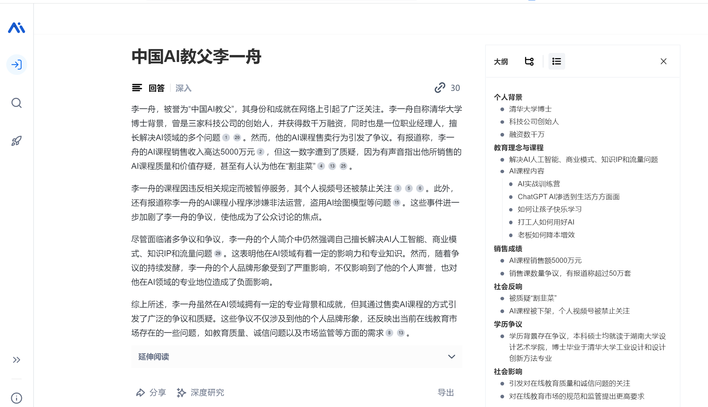
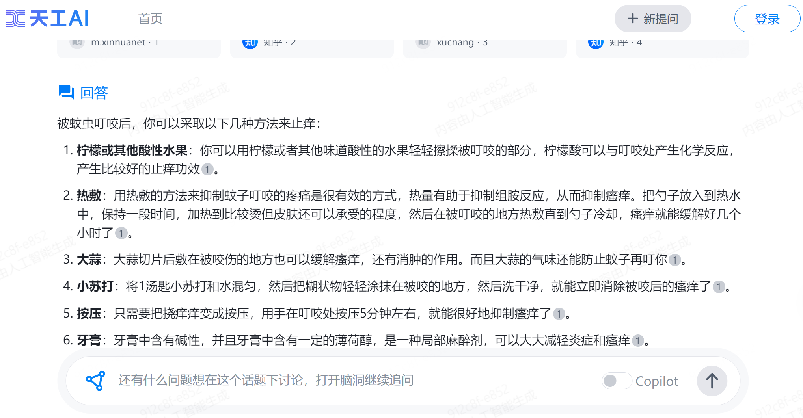

# Awesome Project第18期

## LLM

### Sora原理与技术实战

- 链接：https://datawhaler.feishu.cn/wiki/RKrCw5YY1iNXDHkeYA5cOF4qnkb
  
- 介绍：Datawhale与魔搭社区共同打造的​​Sora技术路径详解，并针对Sora原理中的核心技术点，包括基于diffusion视频生成技术，diffusion Transformers技术解析，video caption技术解析，视频的编解码压缩进行原理介绍，并结合开源模型和代码上手实战。

- 推荐指数：⭐️⭐️⭐️⭐️⭐️

### OpenAI视频生成模型Sora的全面解析

- 链接：https://blog.csdn.net/v_JULY_v/article/details/136143475
  
- 介绍：​该博客包含了​OpenAI视频生成模型Sora的全面解析，从ViViT、Diffusion Transformer到NaViT、VideoPoet，包含三个部分，第一部分侧重sora的核心技术解读；第二部分侧重sora相关技术的发展演变，第三部分根据sora的32个reference以窥探其背后的更多细节。

- 推荐指数：⭐️⭐️⭐️⭐️⭐️

###  Sora AI 视频生成器

- 链接：https://github.com/all-in-aigc/sorafm
  
- 介绍：​​Sora.FM 的 Sora AI 视频生成器，通过输入prompt生成对应视频。

- 体验地址：https://sora.fm

- 推荐指数：⭐️⭐️⭐️⭐️⭐️

### ​​Hugging Multi-Agent

- 链接：https://github.com/datawhalechina/hugging-multi-agent
  
- 介绍：​由Datawhale 打造的多智能体实战课程，​Hugging Multi-Agent 是一套专为期望深入了解并实践多智能体系统的开发者设计的实用指南。基于 MetaGPT 旨在帮助读者掌握多智能体系统的核心概念，并提供一套全面的学习路径，从智能体的基础理解到复杂系统的实际开发。

- 推荐指数：⭐️⭐️⭐️⭐️⭐️

## AI搜索工具

### 秘塔AI搜索

- 链接：https://metaso.cn/
  
- 介绍：​国内一家人工智能科技公司(秘塔科技)推出的​一款AI搜索增强应用，输入搜索关键词后可以直接生成完整答案并给出参考来源。通过语义理解、问题分析、全网搜索对信息进行总结和提炼，为用户呈现清晰明了、重点突出的搜索结果，同时还自动整理了思维导图和大纲，使用户能够迅速地获取关键信息。

- 推荐指数：⭐️⭐️⭐️⭐️⭐️

### 天工AI搜索

- 链接：https://search.tiangong.cn/
  
- 介绍：​由昆仑万维推出的​搜索引擎,采用大语言模型技术，能够通过对话式交互理解用户意图，提供精准、个性化的答案。与传统搜索引擎相比，天工 AI 搜索具备更好的信息提取能力、知识生成能力和意图识别能力。此外，天工AI搜索也即将具备图像、语音等多模态搜索能力，更大程度地释放生产力、提升用户效率。

- 推荐指数：⭐️⭐️⭐️⭐️⭐️

## AI课程

### 魔搭LLM实战训练营

- 链接：https://www.bilibili.com/video/BV1Fi4y1W7XW
  
- 介绍：​​ 魔搭社区前段时间在西安交通大学举办的一门为期7天的大模型带学课程，主要讲述了LLM 大模型基础知识、提示词工程-Prompt Engineering、LLM和多模态模型高效推理实践、大模型微调技术解析和实战、大模型自动评估理论和实战、大模型量化及低成本部署最佳实践及来，亲手做一个A应用！

- 推荐指数：⭐️⭐️⭐️⭐️⭐️