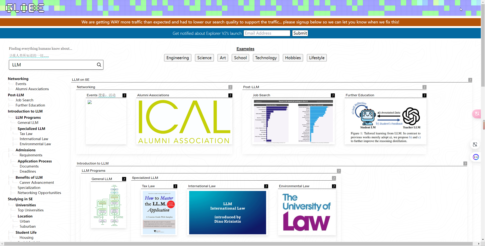
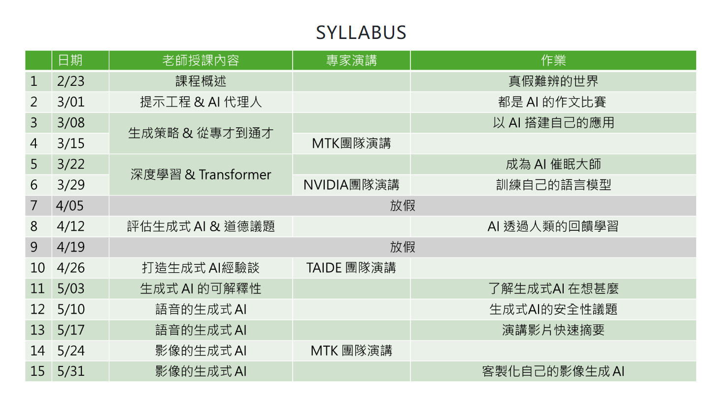

# Awesome Project第20期

## LLM

### Prompt Library

- 链接：https://www.moreusefulthings.com/prompts
  
- 介绍：​​该网站收录了老师和学生常用的提示词，提供了多种大模型（GPT4、Gemini、Claude等）的提示词，可以辅助老师们策划课程、制作课程大纲、设计测验，为学生提供课堂反思助手、模拟谈判、提出反面意见等

- 推荐指数：⭐️⭐️⭐️⭐️⭐️

### Apollo

- 链接：https://github.com/FreedomIntelligence/Apollo
  
- 介绍：​为了将医疗人工智能进步的影响范围扩大到更广泛的人群，我们的目标是开发六种最广泛使用的语言的医疗LLMs，涵盖全球 61 亿人口。这项工作最终创建了 ApolloCorpora 多语言医学数据集和 XMedBench 基准。在多语言医学基准测试中，已发布的Apollo模型在各种相对较小的尺寸（即0.5B、1.8B、2B、6B和7B）下，在同等尺寸的模型中取得了最佳性能。特别是，Apollo-7B 是最先进的多语言医疗LLMs，最高可达 70B。此外，这些精简模型可用于提高大型模型的多语言医疗能力，而无需以代理调整方式进行微调。我们将开源训练语料、代码、模型权重和评估基准。

- 推荐指数：⭐️⭐️⭐️⭐️⭐️

### TensorRT-LLM as OpenAI API on Windows 

- 链接：https://github.com/NVIDIA/trt-llm-as-openai-windows
  
- 介绍：​​此参考可与任何现有的 OpenAI 集成应用程序一起使用，以便在 Windows 上的 GeForce GPU（而不是云）上本地运行 TRT-LLM 推理。

- 推荐指数：⭐️⭐️⭐️⭐️⭐️

### 几何图神经网络综述：数据结构、模型和应用

- 链接：https://github.com/RUC-GLAD/GGNN4Science
  
- 介绍：​​几何图是一种具有几何特征的特殊图，对于建模许多科学问题至关重要。与典型图不同，几何图通常表现出平移、旋转和反射的物理对称性，使得当前的图神经网络（GNN）无法有效地处理它们。为了解决这个问题，研究人员提出了各种具有不变/等变属性的几何图神经网络，以更好地表征几何图的几何和拓扑。该repo总结了应用程序以及相关数据集，以方便后续研究的方法开发和实验评估。最后讨论了几何 GNN 的挑战和未来的潜在方向。

- 推荐指数：⭐️⭐️⭐️⭐️⭐️

## AI工具

### Agent搜索引擎BrainStrom

- 链接：https://brainstorm.cool

- 介绍：​引入Agent，模拟创意产生过程中的不同视角进行头脑风暴，可以使用不同的 Agent 角色从不同角度出发思考同一个问题，从而提供更全面的答案。它可以根据问题，自动调用最适合回答问题的 Agent 。

- 推荐指数：⭐️⭐️⭐️⭐️⭐️

### 搜索引擎Globe

- 链接：https://explorer.globe.engineer

- 介绍：​​Globe Explorer是一款全新的AI搜索引擎，提供个性化搜索体验，支持多语言搜索，致力于提供高质量的搜索结果。它能够将搜索关键词自动整理成思维导图，帮助用户快速明了地查看信息。

- 推荐指数：⭐️⭐️⭐️⭐️⭐️

## AI课程

### 生成式人工智能导论（ 李宏毅）

- 链接：https://speech.ee.ntu.edu.tw/~hylee/genai/2024-spring.php

- 介绍：​​李宏毅老师的新课程《生成式人工智能导论》，该课程将聚焦于基础原理，适合不同背景的学生，让大家都能掌握生成式人工智慧的基本概念。让你不仅只是使用工具，而是理解其背后的原理，修完这门课，当你再次使用ChatGPT 或其他类似工具时，你将能够更深入地理解它们的运作方式，利用它们的潜力和了解他们可能的极限。目标受众为初学者，不需要任何先备知识，也不要求学生事先修过机器学习或人工智慧的课程。

- 推荐指数：⭐️⭐️⭐️⭐️⭐️