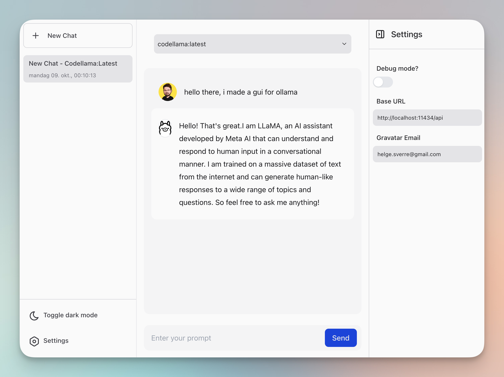
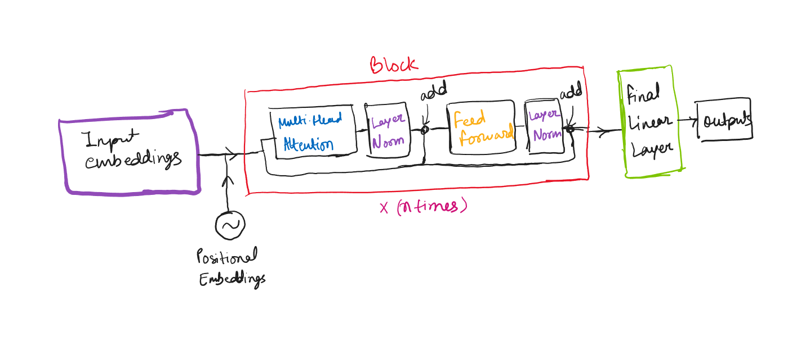

# Awesome Project第21期

## LLM

### LLMs高效框架nm-vllm 

- 链接：https://github.com/neuralmagic/nm-vllm
  
- 介绍：​是由Neural Magic公司创建和维护的​一套用于LLMs的高吞吐量和内存高效的推理和服务引擎，专注于整合最新的 LLM 优化（例如量化和稀疏性）以增强性能。该仓库提供了安装指南、快速开始教程、以及与OpenAI兼容的服务器集成方法，旨在帮助开发者更容易地部署和使用LLM。

- 推荐指数：⭐️⭐️⭐️⭐️⭐️

### 与本地 LLMs 聊天的 Web 界面Ollama GUI

- 链接：https://github.com/HelgeSverre/ollama-gui
  
- 介绍：​​用于通过 ollama API 与本地 LLMs 聊天的 Web 界面

- 推荐指数：⭐️⭐️⭐️⭐️⭐️

### Awesome Local AI

- 链接：https://github.com/janhq/awesome-local-ai
  
- 介绍：​​这个仓库提供了一个丰富的资源列表，收集和展示一系列本地AI工具和解决方案，涵盖了从推理引擎、用户界面、平台/完整解决方案、开发者工具、代理、训练资源、LLM排行榜、研究论文到社区资源等多个方面。

- 推荐指数：⭐️⭐️⭐️⭐️⭐️

### Awesome Open-source Machine Learning for Developers

- 链接：https://github.com/merveenoyan/awesome-osml-for-devs
  
- 介绍：​由merveenoyan创建的，旨在为开发者提供一个关于开源机器学习（OSML）的资源列表。这个仓库收集了各种机器学习相关的工具、库、框架、教程和其他有用的资源。

- 推荐指数：⭐️⭐️⭐️⭐️⭐️

### 小语言模型

- 链接：https://github.com/shivendrra/SmallLanguageModel-project
  
- 介绍：提供了一个从零开始构建小型语言模型（SLM）所需的所有代码和资源，包含了从数据收集到模型架构文件、分词器和训练文件的所有内容，适合那些对自然语言处理和机器学习感兴趣的开发者和研究者。

- 推荐指数：⭐️⭐️⭐️⭐️⭐️

## AI教程

### LLM 应用开发实践笔记

- 链接：https://aitutor.liduos.com/01-llm/01-1.html
  
- 介绍：​​学习开发基于大语言模型的应用过程中，总结出来的一些经验和方法以及接触到的一些资源，采用理论学习和代码实践相结合的形式。

- 推荐指数：⭐️⭐️⭐️⭐️⭐️

## 其他

### Sam Altman的创业手册

- 链接：https://jxp73q7qjsg.feishu.cn/docx/WCNZdKDa4o2eUrxK5ElcfBXEnah?continueFlag=3a6d0325757abca6e8cbb95b53b664d3
  
- 介绍：​​为创业者提供了一套全面的创业指南，涵盖了从想法的孕育、团队的构建、产品的开发到执行策略的实施等各个方面。文章强调了创业的艰辛和挑战，同时也提供了实用的建议和策略，帮助创业者避免常见陷阱，专注于构建伟大的产品和公司。

- 推荐指数：⭐️⭐️⭐️⭐️⭐️

### 全能的网络爬虫框架Botasaurus

- 链接：https://github.com/omkarcloud/botasaurus
  
- 介绍：​​Botasaurus是一个强大且灵活的网络爬虫工具，提供了多种设置来根据特定需求定制爬取过程，提高了效率和便利性。无论是处理多个数据点、需要并行处理还是需要缓存结果，Botasaurus都提供了简化爬取任务所需的功能。

- 推荐指数：⭐️⭐️⭐️⭐️⭐️