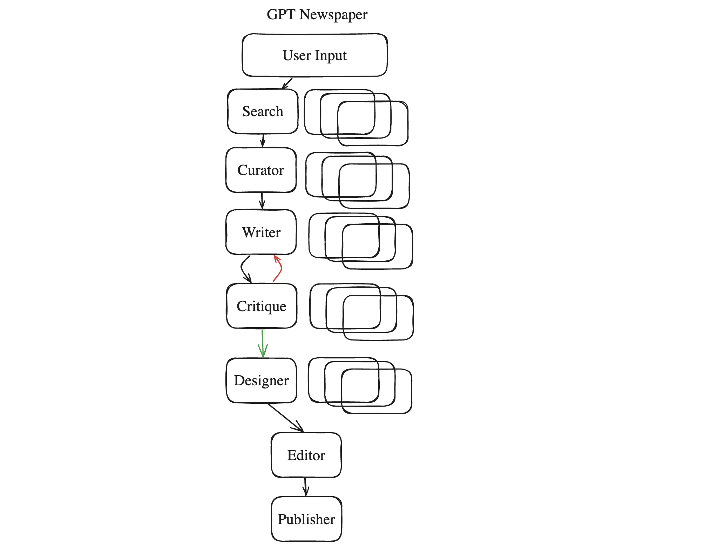
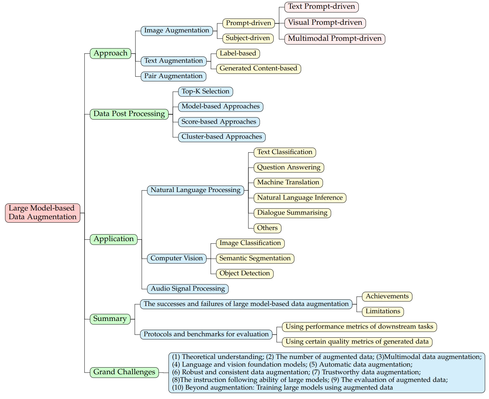

# Awesome Project第22期

## LLM

### Open-Sora： 完全开源的高效复现类Sora视频生成方案

- 链接：https://github.com/hpcaitech/Open-Sora
  
- 介绍：​​Open-Sora项目是一项致力于高效制作高质量视频，并使所有人都能使用其模型、工具和内容的计划。 通过采用开源原则，Open-Sora 不仅实现了先进视频生成技术的低成本普及，还提供了一个精简且用户友好的方案，简化了视频制作的复杂性。 通过 Open-Sora，希望更多开发者一起探索内容创作领域的创新、创造和包容。

- 推荐指数：⭐️⭐️⭐️⭐️⭐️

### GPT Newspaper

- 链接：https://github.com/rotemweiss57/gpt-newspaper
  
- 介绍：GPT Newspaper通过AI技术，根据用户的兴趣和偏好，聚合、编写、设计和编辑内容，从而提供个性化的新闻阅读体验。包含六个专门的子代理，每个代理在创建个性化报纸的过程中扮演关键角色，包括搜索代理、策展代理、写作代理、批评代理、设计代理、编辑代理和发布代理。

- 推荐指数：⭐️⭐️⭐️⭐️⭐️

### localRAG

- 链接：https://github.com/jonfairbanks/local-rag
  
- 介绍：​​本地RAG项目，旨在实现在本地网络环境中使用大型语言模型（LLMs）进行文件摄入和检索增强生成（RAG），而不依赖第三方服务，确保用户敏感数据的安全。

- 推荐指数：⭐️⭐️⭐️⭐️⭐️

### 100多种资源可帮助您成为出色的工程领导者

- 链接：https://github.com/gregorojstersek/resources-to-become-a-great-engineering-leader
  
- 介绍：​​该Repo旨在帮助工程领导者成长，提供了一系列精选的书籍、博客、新闻通讯和行业领袖的链接，覆盖了系统设计、领导力、软件工程、产品思维和数据科学等多个领域，鼓励通过有针对性地学习和社区贡献来提升个人技能。

- 推荐指数：⭐️⭐️⭐️⭐️⭐️

### Awesome Diffusion Distillation 

- 链接：https://github.com/cantbebetter2/Awesome-Diffusion-Distillation
  
- 介绍：该repo整理了​​有关扩散蒸馏的论文、文档、代码列表。此存储库收集了扩散模型的各种蒸馏方法。

- 推荐指数：⭐️⭐️⭐️⭐️⭐️

### 有关使用大型模型进行数据增强的论文和资源

- 链接：https://github.com/MLGroup-JLU/LLM-data-aug-survey
  
- 介绍：​​本文采用综合视角，对大型模型驱动的数据增强方法进行了详尽的回顾。我们首先将相关研究分为三个主要类别：图像增强、文本增强和配对数据增强。接下来，我们深入研究与基于大型模型的数据增强相关的各种数据后处理技术。然后，我们的讨论扩展到涵盖这些数据增强方法在自然语言处理、计算机视觉和音频信号处理中的一系列应用。我们继续评估不同场景中基于大型模型的数据增强的成功和局限性。在总结我们的审查时，我们强调了数据增强领域未来探索的潜在挑战和途径。

- 推荐指数：⭐️⭐️⭐️⭐️⭐️

### 我从 900 个最流行的开源 AI 工具中学到了什么

- 链接：https://huyenchip.com//2024/03/14/ai-oss.html
  
- 介绍：​​文章分享了作者对900个最受欢迎的开源人工智能工具进行分析后的见解和发现。作者将AI技术栈视为由四层组成：基础设施、模型开发、应用开发和应用程序。
- 基础设施层包括服务工具、计算管理、向量搜索和数据库等。
- 模型开发层提供开发模型的工具，包括建模与训练框架、推理优化、数据集工程、评估等。
- 应用开发层是在过去两年中活动最多的层，也称为AI工程，涉及提示工程、RAG（检索增强生成）、AI接口等。
- 应用程序层是构建在现有模型之上的开源应用程序。
并讨论了开源AI开发者的贡献，特别是中国开源生态系统的增长以及个人开发者的影响力。此外，文章还提到了AI工具的快速增长与衰退现象，并分享了作者个人感兴趣的一些创新点子。详情请见上方链接。

- 推荐指数：⭐️⭐️⭐️⭐️⭐️

### RWKV_Pytorch

- 链接：https://github.com/yuunnn-w/RWKV_Pytorch
  
- 介绍：​​这是一个用纯Pytorch原生实现的RWKV大语言模型的推理框架，官方的原生实现过于复杂且无法拓展生态，支持batch推理,代码整洁，容易阅读和二次开发;支持导出并推理onnx格式模型！

- 推荐指数：⭐️⭐️⭐️⭐️⭐️