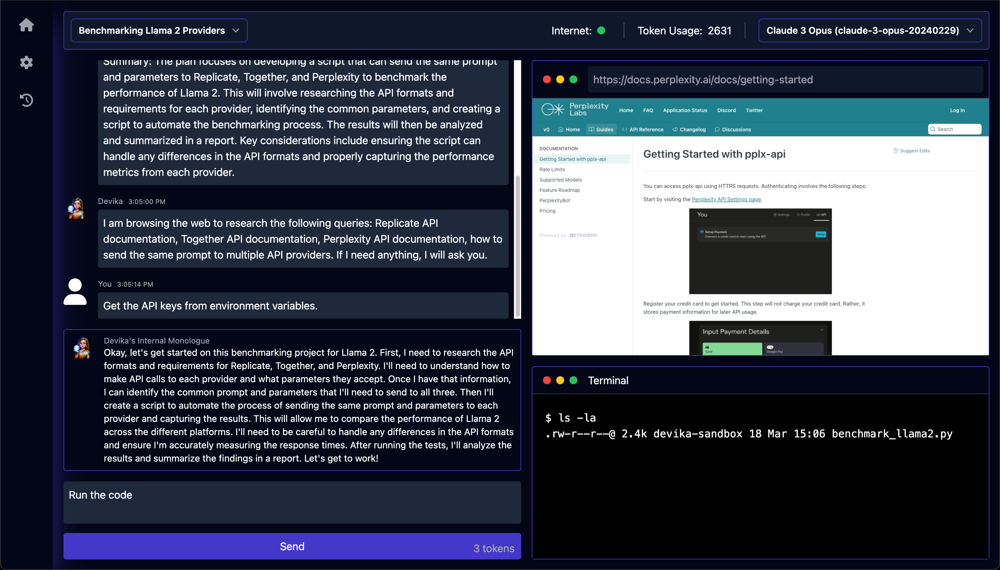

# Awesome Project第23期

## LLM

### 利用大模型，一键生成短视频

- 链接：https://github.com/harry0703/MoneyPrinterTurbo
  
- 介绍：​一键生成短视频，用户只需提供视频主题或关键词，系统便能自动生成视频文案、素材、字幕和背景音乐，并合成高清短视频。
  - **MVC架构**：代码结构清晰，易于维护，支持API和Web界面。
  - **AI自动生成文案**：支持视频文案自动生成，也允许用户自定义文案。
  - **高清视频尺寸支持**：支持竖屏9:16（1080x1920）和横屏16:9（1920x1080）的视频尺寸。
  - **批量视频生成**：可以一次生成多个视频，方便用户选择最满意的作品。
  - **视频片段时长设置**：用户可以调节素材切换频率。
  - **多语言支持**：支持中文和英文视频文案。
  - **多种语音合成**：支持多种语音合成选项。
  - **字幕生成**：用户可以调整字体、位置、颜色、大小，并支持字幕描边设置。
  - **背景音乐**：支持随机或指定音乐文件，可设置背景音乐音量。
  - **高清无版权素材**：视频素材来源高清且无版权问题。
  - **多模型接入**：支持OpenAI、Moonshot、Azure、gpt4free、one-api等多种模型接入。

- 推荐指数：⭐️⭐️⭐️⭐️⭐️

### RAGTune

- 链接：https://github.com/misbahsy/RAGTune
  
- 介绍：​​AGTune是一个为RAG管道提供调优和评估的自动化工具，它支持多种大型语言模型和嵌入模型，提供了丰富的评估指标，并允许用户进行定制化设置。

- 推荐指数：⭐️⭐️⭐️⭐️⭐️

### ​Auto-Coder

- 链接：https://github.com/allwefantasy/auto-coder
  
- 介绍：​​Auto-Coder项目为开发者提供了一个强大的工具，通过AI的辅助，可以大幅提高编程效率和代码质量。无论是生成代码上下文还是直接生成代码结果，Auto-Coder都能够满足开发者的不同需求，使得AI编程变得更加简单和高效。

- 推荐指数：⭐️⭐️⭐️⭐️⭐️

### AIOS: LLM Agent Operating System

- 链接：https://github.com/agiresearch/AIOS
  
- 介绍：​​AIOS是一个操作系统，它将大型语言模型作为操作系统的核心，优化资源分配，促进代理之间的上下文切换，支持代理的并发执行，为代理提供工具服务，维护代理的访问控制，并为LLM代理开发者提供丰富的工具包。

- 推荐指数：⭐️⭐️⭐️⭐️⭐️

### LLMs Survey

- 链接：https://github.com/NiuTrans/ABigSurveyOfLLMs
  
- 介绍：​​本项目旨在提供一个全面的调查，涵盖大型预训练语言模型的最新进展，包括模型架构、训练技术、应用场景和未来发展趋势等。

- 推荐指数：⭐️⭐️⭐️⭐️⭐️

### Agentic AI 软件工程师

- 链接：https://github.com/stitionai/devika
  
- 介绍：​​Devika 是一名代理人工智能软件工程师，可以理解高级人类指令，将其分解为步骤，研究相关信息，并编写代码来实现给定的目标。 Devika 的目标是成为 Cognition AI 的 Devin 的有竞争力的开源替代品。

- 推荐指数：⭐️⭐️⭐️⭐️⭐️

### awesome-generative-ai-guide

- 链接：https://github.com/aishwaryanr/awesome-generative-ai-guide
  
- 介绍：​​专注于生成性人工智能（Generative AI）领域，旨在为那些对生成模型、深度学习和人工智能感兴趣的研究人员、开发者和爱好者提供一个全面的指南。该项目包含了大量的资源链接，如学术论文、教程、博客文章、开源项目和工具等，涵盖了从基础概念到高级技术应用的各个方面。它不仅有助于初学者快速了解和入门生成性AI，也为经验丰富的研究者提供了深入研究和探索该领域最新进展的宝贵资料。

- 推荐指数：⭐️⭐️⭐️⭐️⭐️

### OpenDevin

- 链接：https://github.com/OpenDevin/OpenDevin
  
- 介绍：这是一个旨在复制 Devin 的开源项目，Devin 是一位自主人工智能软件工程师，能够执行复杂的工程任务并在软件开发项目上与用户积极协作。该项目致力于通过开源社区的力量复制、增强和创新 Devin。目标是解决代码LLMs在实际场景中面临的挑战，制作出对社区有重大贡献的作品，并为未来的进步铺平道路。
  
- 推荐指数：⭐️⭐️⭐️⭐️⭐️