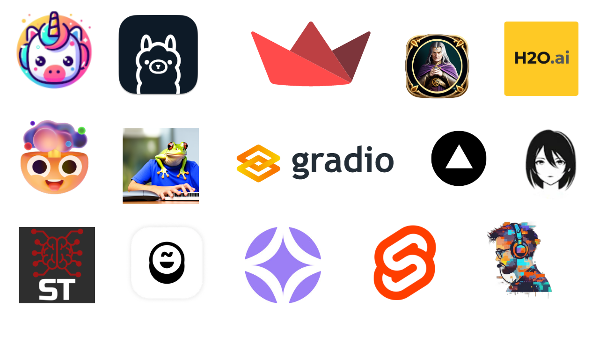

# Awesome Project第25期

## LLM

### 大模型评估库simple-evals 

- 链接：https://github.com/openai/simple-evals
  
- 介绍：​simple-evals是由OpenAI创建的轻量级库，旨在提供一个透明和标准化的方式来评估语言模型的性能。该库特别强调零样本和思维链的评估设置，并通过简单的指令来测试模型的实际应用性能。目前，它包含了多种评估任务，如MMLU、MATH、GPQA等，以及对不同语言模型API的采样接口。

- 推荐指数：⭐️⭐️⭐️⭐️⭐️

### Awesome LLM Web UI

- 链接：https://github.com/JShollaj/awesome-llm-web-ui
  
- 介绍：​​该存储库致力于列出最出色的大型语言模型 (LLM) Web 用户界面，可促进与强大的 AI 模型的交互。探索并编录了用于与 LLMs 交互的最直观、功能丰富且创新的 Web 界面。这些 UI 范围从简单的聊天机器人到配备 PDF 生成、网络搜索等功能的综合平台。

- 推荐指数：⭐️⭐️⭐️⭐️⭐️

### 用于可视化 LLM 评估的 Streamlit 应用程序

- 链接：https://github.com/mosaicml/llm-eval-dashboard
  
- 介绍：​​这个 Streamlip 应用程序接收一个 Markdown 表（行：模型，列：评估）并使用雷达图将其可视化。

- 推荐指数：⭐️⭐️⭐️⭐️⭐️

### Awesome-Mamba-Collection

- 链接：https://github.com/XiudingCai/Awesome-Mamba-Collection
  
- 介绍：​​该存储库是与 Mamba 相关的论文、教程、视频和其他有价值资源的精选集合。无论您是初学者还是经验丰富的用户，本合集旨在为 Mamba 的所有内容提供全面的参考。探索最新的研究论文、深入了解有用的教程并发现富有洞察力的视频，以增强您对 Mamba 的理解和熟练程度。

- 推荐指数：⭐️⭐️⭐️⭐️⭐️

### 执简：为预训练模型复用提供快速部署的统一方案

- 链接：https://github.com/zhangyikaii/LAMDA-ZhiJian
  
- 介绍：​​ZhiJian (执简驭繁) 是一个基于PyTorch框架的模型复用工具包，为再次利用许多基座预训练模型以及已有任务上的已训练模型，充分提取它们蕴含的知识并激发目标任务上的学习，提供了全面且统一的复用方案。模型复用通过适配网络结构、定制学习方式以及优化推理策略来利用这些预训练模型，来进一步加速和强化目标任务上的学习，为了全面而简洁地考虑各种模型复用策略，ZhiJian 将复用方法归类为三个主要模块：构建者，微调者，和融合者，它们分别与目标任务部署时模型准备阶段、学习阶段和推理阶段相对应。

- 推荐指数：⭐️⭐️⭐️⭐️⭐️

### 使用简单、原始的 C/CUDA 进行训练LLM

- 链接：http://github.com/karpathy/llm.c
  
- 介绍：​​LLM 使用简单、纯 C/CUDA 进行训练。不需要 245MB 的 PyTorch 或 107MB 的 cPython。例如，训练 GPT-2（CPU、fp32）需要在单个文件中包含大约 1,000 行干净的代码。它可以立即编译并运行，并且与 PyTorch 参考实现完全匹配。

- 推荐指数：⭐️⭐️⭐️⭐️⭐️

### 1.4B参数量的HammerLLM

- 链接：https://github.com/Academic-Hammer/HammerLLM
  
- 介绍：​​该项目是一个小型大型语言模型（sLLM），拥有14亿参数，基于Llama 2架构。HammerLLM支持中英文以及代码生成，具有简单高效的训练代码库、完整的开源资源（包括模型权重、环境、代码库和超参数）以及与类似规模的先进sLLM相当的性能。此外，它还拥有高压缩率的分词器，能100%覆盖中文字符。项目页面还提供了使用示例代码、不同场景下的文本生成案例、预训练模型信息、性能测试结果、分词器对比、训练进度和贡献指南等详细信息。

- 推荐指数：⭐️⭐️⭐️⭐️⭐️

## AI教程

### LLM训练指南

- 链接：https://gist.github.com/btbytes/cf845f9ade1cb34348110c14c8c49cea
  
- 介绍：​教程​系统地讲解了如何使用 Transformers 库和 Transformer 网络架构训练大型语言模型 (LLM)，包含Transformer 架构、预训练、微调、低秩适应、从头开始训练、本地微调、训练超参数等内容。

- 推荐指数：⭐️⭐️⭐️⭐️⭐️