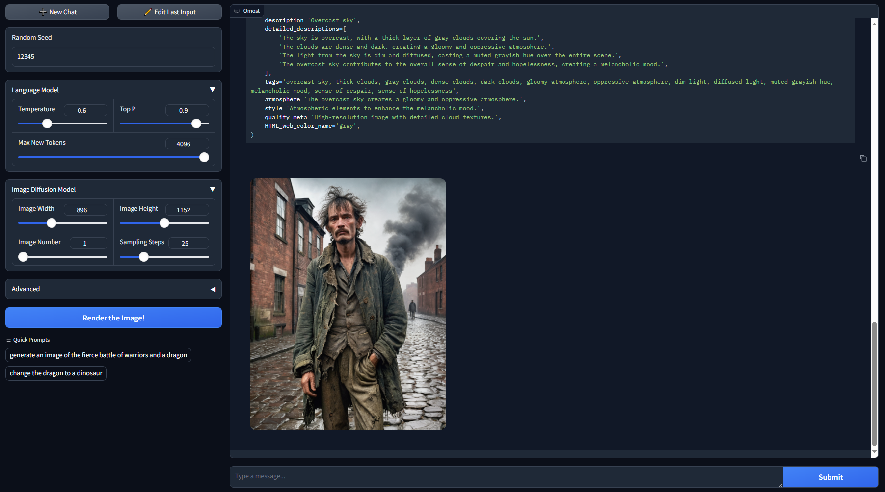
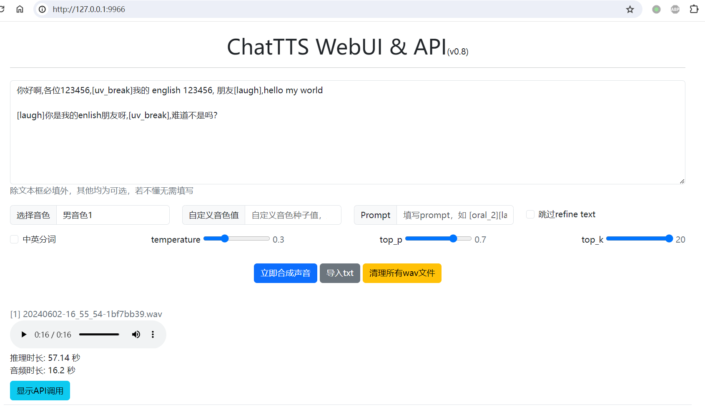
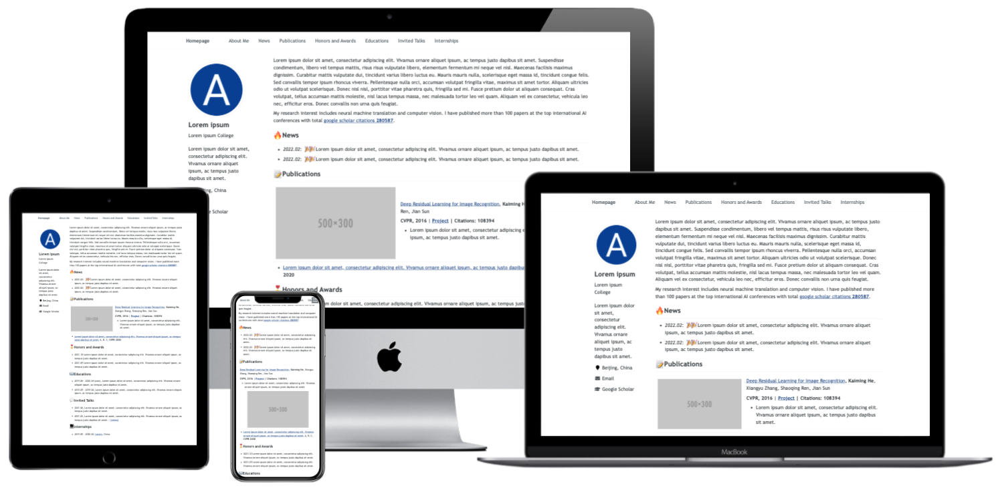

# Awesome Project第30期

## LLM

### Omost

- 链接：https://github.com/lllyasviel/Omost
  
- 介绍：​​Omost是一个将编码能力转换为LLM图像生成能力的项目。Omost提供了LLMs一些模型，这些模型将编写代码，以使用Omost的虚拟 Canvas 代理来组合图像视觉内容。这 Canvas 可以通过图像生成器的特定实现来呈现，以实际生成图像。所有模型都使用混合数据进行训练：（1） 包括 Open-Images 在内的多个数据集的地面实况注释，（2） 通过自动注释图像提取数据，（3） 来自 DPO（直接偏好优化，“代码是否可以由 python 3.10 编译”作为直接偏好）的强化，以及 （4） 来自 OpenAI GPT4o 多模态功能的少量调整数据。

- 推荐指数：⭐️⭐️⭐️⭐️⭐️

### ChatTTS

- 链接：https://github.com/2noise/ChatTTS。
  
- 介绍：​ChatTTS是专门为对话场景设计的文本转语音模型，例如LLM助手对话任务。它支持英文和中文两种语言。最大的模型使用了10万小时以上的中英文数据进行训练。在HuggingFace中开源的版本为4万小时训练且未SFT的版本.

- 推荐指数：⭐️⭐️⭐️⭐️⭐️

### ChatTTS webUI & API

- 链接：https://github.com/jianchang512/ChatTTS-ui
  
- 介绍：​​一个简单的本地网页界面，直接在网页使用 ChatTTS 将文字合成为语音，同时支持对外提供API接口。

- 推荐指数：⭐️⭐️⭐️⭐️⭐️

### ExtractThinker

- 链接：https://github.com/enoch3712/ExtractThinker
  
- 介绍：​​ExtractThinker 是一款基于大型语言模型 (LLM) 的人工智能文档智能工具，它可以帮助您从各种文档中提取关键信息。它可以用于各种任务，例如：从文本中提取事实和数据、总结文章的主要内容、生成摘要、翻译语言、创建问答系统。

- 推荐指数：⭐️⭐️⭐️⭐️⭐️

### surya

- 链接：https://github.com/VikParuchuri/surya
  
- 介绍：​一款​OCR、布局分析、阅读顺序、90+ 种语言的行检测工具。

- 推荐指数：⭐️⭐️⭐️⭐️⭐️

### AutoRAG

- 链接：https://github.com/Marker-Inc-Korea/AutoRAG
  
- 介绍：​​AutoRAG 是一种用于为“您的数据”寻找最佳 RAG 管道的工具。您可以使用自己的评估数据自动评估各种 RAG 模块，并找到适合您自己的用例的最佳 RAG 管道。AutoRAG 支持一种简单的方法来评估许多 RAG 模块组合。立即尝试并找到适合您自己的用例的最佳 RAG 管道。

- 推荐指数：⭐️⭐️⭐️⭐️⭐️

### everything-ai

- 链接：https://github.com/AstraBert/everything-ai
  
- 介绍：​一款人工智能本地聊天机器人助手，支持各种任务，包括利用qdrant后端构建检索友好的知识库、类似ChatGPT的文本生成、文本摘要、图像生成、图像分类、图像到文本的描述、音频分类、语音识别、视频生成、蛋白质折叠结构预测、自动微调模型、使用HF Spaces API与Supabase数据库结合、以及使用lamma.cpp和qdrant进行检索文本生成等。这些任务支持多种语言，部分任务需要特定的硬件支持，如GPU。

- 推荐指数：⭐️⭐️⭐️⭐️⭐️

## 其他工具

### 中文学术主页

- 链接：https://github.com/tangjyan/zh-cn
  
- 介绍：​​这个项目仓库提供了一个自动更新且优化设计的个人学术主页解决方案。它利用谷歌学术爬虫和GitHub Actions实现引用数的自动更新，支持谷歌Analytics进行流量追踪，具备响应式设计以适配多种设备屏幕，展现美观简约的界面风格，并融入搜索引擎优化策略，有助于提升在线可见性和排名，非常适合学者构建专业在线形象。

- 推荐指数：⭐️⭐️⭐️⭐️⭐️